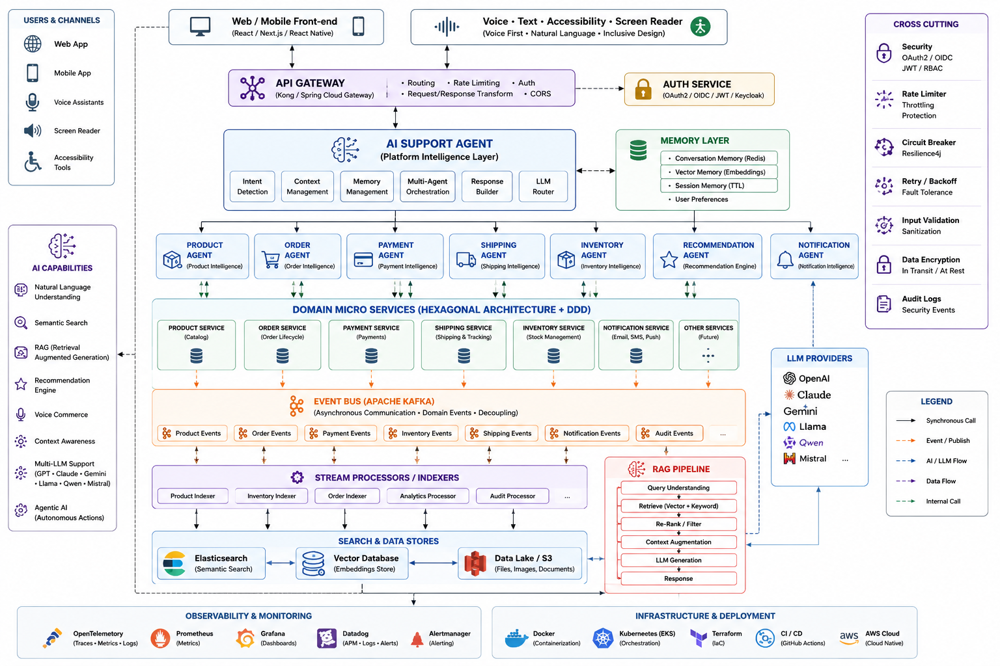

# AI-Commerce | Product Service

<p align="center">


</p>

---

# AI-Commerce Platform

AI-Commerce Platform is an **enterprise-grade, AI-first, cloud-native commerce ecosystem** designed to demonstrate modern software engineering, Artificial Intelligence, Accessibility, and Cloud Architecture.

The platform combines **Java 21**, **Spring Boot**, **Hexagonal Architecture**, **Domain-Driven Design (DDD)**, **Event-Driven Architecture**, **Generative AI**, **Semantic Search**, **RAG (Retrieval-Augmented Generation)** and **AWS Cloud** to build an intelligent shopping experience.

Unlike traditional e-commerce platforms, AI-Commerce places an **AI Support Agent** at the center of the customer journey. Instead of navigating complex menus, users can interact naturally through voice or text, while specialized AI Agents orchestrate domain services, semantic search, recommendations and business workflows.

The platform was also designed with **Accessibility by Design**, allowing users with visual impairments or reduced mobility to navigate the entire application using voice interaction, screen readers and conversational AI.

# Platform Vision

The AI-Commerce Platform is designed around a central intelligence layer responsible for orchestrating the entire customer experience.

Instead of users manually searching products, navigating categories or filling long forms, the platform provides an AI-powered conversational assistant capable of:

- Voice-first interaction
- Natural Language Understanding (NLU)
- Semantic Product Search
- Intelligent Recommendations
- Context Awareness
- Accessibility Support
- Shopping Guidance
- Order Assistance
- Personalized Experience

The AI Support Agent delegates specialized tasks to Domain AI Agents, which communicate with business microservices while keeping responsibilities isolated following DDD and Hexagonal Architecture.

# Accessibility

Accessibility is a first-class citizen of the AI-Commerce Platform.

Features include:

- Voice Navigation
- Screen Reader Support
- Voice Authentication
- Conversational Registration
- Keyboard Navigation
- Inclusive Design
- AI Assisted Shopping
- Voice Product Search
- Accessible Checkout

# Platform Architecture

<p align="center">



</p>


## Product Service

The Product Service is the authoritative source of product information within the AI-Commerce ecosystem.

Its responsibilities include:

- Product Catalog
- Product Lifecycle
- Inventory Metadata
- Search Metadata
- AI Metadata
- Product Events
- Domain Validation
- Rich Domain Model

The Product Service does not execute Artificial Intelligence directly.

Instead, it publishes business events that are consumed by indexing services responsible for updating Elasticsearch, Vector Database and Recommendation pipelines.


# Main Objectives

This project aims to simulate how enterprise software is developed inside large technology companies.

Main goals include:

- Build production-ready Java microservices
- Apply Domain-Driven Design (DDD)
- Apply Hexagonal Architecture
- Implement SOLID Principles
- Design Rich Domain Models
- Build Event-Driven Systems
- Prepare services for Kubernetes
- Build AWS-ready applications
- Implement Enterprise Observability
- Achieve high automated test coverage
- Apply CI/CD pipelines
- Integrate Artificial Intelligence
- Support AI Agents
- Support Semantic Search
- Support Vector Search
- Prepare the platform for RAG
- AI-First Architecture
- Multi-Agent AI Platform
- Accessibility by Design
- Voice Commerce
- Context Awareness
- Observability
- Event-Driven Architecture

---

# Current Features

Current implementation includes:

- ✅ Product CRUD
- ✅ Rich Domain Model
- ✅ Value Objects
- ✅ Aggregate Root
- ✅ Domain Events
- ✅ Business Rules
- ✅ Hexagonal Architecture
- ✅ REST API
- ✅ Bean Validation
- ✅ PostgreSQL
- ✅ Flyway
- ✅ Docker
- ✅ Swagger/OpenAPI
- ✅ Unit Tests
- ✅ Integration Tests
- ✅ Mockito
- ✅ Spring Boot Test
- ✅ Testcontainers
- ✅ JaCoCo
- ✅ SonarCloud
- ✅ GitHub Actions

---

# AI-Native Roadmap

The Product Service is evolving from a traditional catalog into an AI-ready business service.

Upcoming AI capabilities include:

- AI Product Descriptions
- AI Keywords
- AI Search Context
- Product Embeddings
- Semantic Search
- Recommendation Engine
- Similar Products
- Product Ranking
- Vector Database Integration
- Elasticsearch Integration
- Product Agent Integration
- Retrieval-Augmented Generation (RAG)
- AI Support Agent
- Product Agent
- Order Agent
- Payment Agent
- Inventory Agent
- Recommendation Agent
- Notification Agent
- API Gateway
- Kafka Event Bus
- Elasticsearch
- Vector Database
- RAG Pipeline
- Redis Conversation Memory
- OpenTelemetry
- Datadog
- Prometheus
- Grafana
- Kubernetes
- AWS

---

# Enterprise Principles

The Product Service follows modern enterprise software engineering principles.

- Domain-Driven Design (DDD)
- Hexagonal Architecture
- SOLID Principles
- Clean Code
- Rich Domain Model
- Event-Driven Architecture
- Cloud-Native Design
- AI-Native Architecture
- Production-Ready Development
- Test-Driven Quality
- Continuous Integration
- Continuous Inspection
- Enterprise Observability

---

# Technology Stack

## Backend

- Java 21
- Spring Boot 3.5
- Spring Data JPA
- Spring Validation
- Spring Security (planned)
- Spring Events

## Database

- PostgreSQL 16
- Flyway

## Messaging

- Apache Kafka *(planned)*

## Artificial Intelligence

- AI Support Agent
- Product Agent *(planned)*
- Retrieval-Augmented Generation *(planned)*
- Semantic Search *(planned)*
- Vector Database *(planned)*
- Elasticsearch *(planned)*

## Cloud

- Docker
- Docker Compose
- Kubernetes *(planned)*
- AWS ECS *(planned)*
- AWS EKS *(planned)*
- Terraform *(planned)*

## Observability

- Micrometer *(planned)*
- OpenTelemetry *(planned)*
- Datadog *(planned)*
- Prometheus *(planned)*
- Grafana *(planned)*

## Quality

- JUnit 5
- Mockito
- Spring Boot Test
- Testcontainers
- JaCoCo
- SonarCloud
- GitHub Actions

---

# Current Development Status

| Area | Status |
|-------|:------:|
| Product CRUD | ✅ |
| Rich Domain | ✅ |
| Hexagonal Architecture | ✅ |
| DDD | ✅ |
| Unit Tests | ✅ |
| Integration Tests | ✅ |
| PostgreSQL | ✅ |
| Flyway | ✅ |
| Docker | ✅ |
| Swagger | ✅ |
| GitHub Actions | ✅ |
| SonarCloud | ✅ |
| AI Ready Domain | 🚧 |
| Kafka Integration | 🚧 |
| Observability | 🚧 |
| Elasticsearch | ⏳ |
| Product Agent | ⏳ |
| Vector Database | ⏳ |
| Recommendation Engine | ⏳ |
| AWS Deployment | ⏳ |

---
# System Architecture

The Product Service follows a strict implementation of **Hexagonal Architecture (Ports & Adapters)** combined with **Domain-Driven Design (DDD)**.

The primary goal is to isolate business rules from frameworks, databases and external services, ensuring that the domain remains independent and highly maintainable.

```
                         External World

                               │

             REST API / AI Agents / Kafka Consumers

                               │

                 Inbound Adapters (Controllers)

                               │

                    Application Layer (Use Cases)

                               │

                     Inbound Ports (Interfaces)

                               │

──────────────────────────────────────────────────────────

                     DOMAIN (Business Core)

         Aggregate Roots • Entities • Value Objects

          Domain Events • Domain Services • Policies

──────────────────────────────────────────────────────────

                               │

                   Outbound Ports (Interfaces)

                               │

       Persistence • Kafka • Search • AI • Observability

                               │

                 Outbound Adapters (Infrastructure)

                               │

 PostgreSQL • Kafka • Elasticsearch • Datadog • AWS
```

---

# Project Structure

```
src

├── adapters
│
│   ├── inbound
│   │
│   │   ├── controller
│   │   ├── mapper
│   │   ├── request
│   │   └── response
│   │
│   └── outbound
│
│       ├── persistence
│       ├── kafka
│       ├── search
│       ├── ai
│       ├── observability
│       └── cache
│
├── application
│
│   ├── command
│   ├── query
│   ├── dto
│   ├── mapper
│   ├── service
│   └── usecase
│
├── domain
│
│   ├── model
│   ├── event
│   ├── ports
│   ├── service
│   ├── policy
│   ├── shared
│   ├── exception
│   └── valueobject
│
├── infrastructure
│
│   ├── config
│   ├── kafka
│   ├── observability
│   ├── security
│   └── persistence
│
└── config
```

---

# Domain Model

The Product Aggregate is the heart of the microservice.

Instead of storing only CRUD information, the Product has been redesigned to support Artificial Intelligence, Semantic Search, Recommendation Engines and Enterprise Analytics.

Future Aggregate:

```
Product

├── ProductId
├── SKU

├── ProductName
├── ShortDescription
├── Description

├── BrandId
├── CategoryId

├── Price
├── Cost
├── Currency

├── StockQuantity

├── Weight
├── Dimensions

├── Images

├── TechnicalSpecifications

├── Attributes

├── Tags

├── Keywords

├── AI Description

├── AI Keywords

├── Embeddings Id

├── Search Score

├── Popularity Score

├── Rating

├── Total Reviews

├── Product Status

├── Created At
└── Updated At
```

---

# Why a Rich Product Model?

Traditional CRUD applications usually store only:

```
Name

Description

Price
```

The AI-Commerce Product Service stores much richer business information because AI systems require contextual information.

Example:

Customer says:

> "Show me lightweight gaming notebooks under 3kg with RTX graphics."

The AI must understand:

- Product Category
- Weight
- Technical Specifications
- Tags
- Keywords
- Product Description
- AI Description
- Search Score
- Product Popularity

instead of performing a simple SQL query.

---

# Product Lifecycle

```
Create Product

↓

Draft

↓

Validation

↓

Activate

↓

Available for Sale

↓

Indexed

↓

Embedded

↓

AI Search Ready

↓

Recommendation Ready

↓

Archived
```

---

# Product Domain Events

Every important business action generates a Domain Event.

Current Events

```
ProductCreatedEvent

ProductUpdatedEvent

ProductActivatedEvent

ProductDeactivatedEvent
```

Future Events

```
ProductPriceChangedEvent

ProductStockUpdatedEvent

ProductInventoryLowEvent

ProductImageUpdatedEvent

ProductIndexedEvent

ProductEmbeddingGeneratedEvent

ProductPublishedEvent

ProductDeletedEvent
```

These events will later be published to Kafka.

---

# Event-Driven Architecture

Future architecture:

```
Product Created

↓

Kafka

↓

Product Agent

↓

Search Index

↓

Vector Database

↓

Recommendation Engine

↓

Analytics

↓

Notification Service

↓

Audit Service
```

The Product Service never directly calls these systems.

It simply publishes business events.

---

# Kafka Integration

Kafka will become the communication backbone of the AI-Commerce Platform.

The Product Service will publish events whenever the product changes.

Example Topics

```
product.created

product.updated

product.deleted

product.stock.updated

product.price.updated

product.activated

product.deactivated
```

Consumers

```
AI Product Agent

Search Service

Recommendation Engine

Inventory Service

Analytics Service

Notification Service
```

---

# Artificial Intelligence Integration

The Product Service itself **does not execute AI models**.

Its responsibility is to expose high-quality business data.

The AI processing happens inside the AI Product Agent.

```
Customer

↓

AI Support Agent

↓

Product Agent

↓

Product Service

↓

PostgreSQL

↓

Product Context

↓

AI Product Agent

↓

LLM

↓

Customer
```

This separation follows the Single Responsibility Principle.

---

# Product Agent Responsibilities

The Product Agent is responsible for:

- Understanding product-related questions
- Executing semantic searches
- Querying Elasticsearch
- Querying Vector Database
- Building RAG context
- Ranking products
- Returning structured context to the AI Support Agent

The Product Service remains responsible only for business rules.

---

# Semantic Search

Instead of searching only by product name:

```
LIKE '%Notebook%'
```

The AI Platform will support searches such as:

```
Gaming notebook

Lightweight laptop

Notebook for programming

Best notebook for AI

Affordable gaming computer
```

This will be implemented using:

- Elasticsearch
- Vector Database
- Embeddings
- Product Metadata

---

# Vector Database

Every product will eventually generate an embedding.

```
Product Description

↓

Embedding Model

↓

Vector

↓

Vector Database
```

The AI Product Agent will use these vectors for semantic similarity searches.

---

# Enterprise Observability

The Product Service is being designed with observability from the beginning.

Components

```
Micrometer

↓

OpenTelemetry

↓

Datadog

↓

Dashboards

↓

Alerts
```

---

# Business Metrics

Future dashboards will expose metrics such as:

```
Products Created

Products Updated

Products Activated

Products Sold

Average Rating

Products per Category

Products by Brand

Average Stock

Low Inventory

Search Requests

AI Requests

Recommendation Requests
```

---

# Technical Metrics

The platform will also monitor:

```
HTTP Requests

Response Time

CPU

Memory

Database Connections

Kafka Producers

Kafka Consumers

Cache Hits

Exceptions

JVM Metrics

Garbage Collection

Threads

SQL Performance
```

---

# Distributed Tracing

Every request will receive a Trace ID.

```
Frontend

↓

API Gateway

↓

AI Support Agent

↓

Product Agent

↓

Product Service

↓

PostgreSQL
```

This makes debugging production issues significantly easier.

---

# Logging Strategy

The service will use structured logging.

Example

```
INFO

Product Created

ProductId

UserId

CorrelationId

Timestamp

Execution Time
```

Logs will later be centralized in Datadog.

---

# Enterprise Design Principles

The Product Service follows several architectural principles:

- Domain First
- Rich Domain Model
- Event-Driven Communication
- AI-Ready Architecture
- Cloud-Native Design
- Framework Independence
- High Cohesion
- Low Coupling
- SOLID Principles
- Clean Architecture
- Observability by Design
- Scalability by Design
- Production-Ready Code

---
# REST API

The Product Service exposes a RESTful API responsible for managing the product catalog of the AI-Commerce Platform.

Current endpoints:

| Method | Endpoint | Description |
|----------|---------------------------|--------------------------------|
| POST | `/api/v1/products` | Create Product |
| GET | `/api/v1/products/{id}` | Find Product |
| GET | `/api/v1/products` | List Products |
| PUT | `/api/v1/products/{id}` | Update Product |
| DELETE | `/api/v1/products/{id}` | Delete Product |

---

# Future REST Endpoints

As the domain evolves, new business capabilities will be added.

### Product Search

```
GET /products/search
```

### Semantic Search

```
GET /products/semantic-search
```

### AI Recommendations

```
GET /products/recommendations
```

### Similar Products

```
GET /products/{id}/similar
```

### Product Reviews

```
GET /products/{id}/reviews
```

### Product Metrics

```
GET /products/{id}/metrics
```

### Product Popularity

```
GET /products/popular
```

---

# Swagger Documentation

Swagger UI

```
http://localhost:8081/swagger-ui/index.html
```

OpenAPI Specification

```
http://localhost:8081/v3/api-docs
```

---

# Database

The Product Service uses PostgreSQL as its primary relational database.

```
Host: localhost

Port: 5432

Database: productdb

Username: postgres

Password: postgres
```

---

# Flyway

Database versioning is managed using Flyway.

Current migration

```
V1__create_products_table.sql
```

Future migrations

```
V2__product_price.sql

V3__inventory.sql

V4__product_attributes.sql

V5__technical_specifications.sql

V6__product_images.sql

V7__ai_fields.sql

V8__search_metadata.sql

V9__observability.sql
```

---

# Running the Project

Clone repository

```bash
git clone https://github.com/oliversantos573/ai-commerce-product-service.git
```

Enter project

```bash
cd ai-commerce-product-service
```

Compile

```bash
mvn clean compile
```

Execute tests

```bash
mvn verify
```

Run application

```bash
mvn spring-boot:run
```

---

# Docker

Start PostgreSQL

```bash
docker compose up -d
```

Stop

```bash
docker compose down
```

---

# Testing Strategy

One of the main objectives of this project is to achieve enterprise-level quality through automated testing.

Testing is performed across multiple architectural layers.

```
Presentation Layer

↓

Application Layer

↓

Domain Layer

↓

Persistence Layer

↓

Infrastructure
```

---

# Unit Tests

Frameworks

- JUnit 5
- Mockito
- AssertJ

Covered Components

- Aggregate Roots
- Value Objects
- Domain Events
- Application Services
- Commands
- Queries
- Mappers
- Validators
- Business Rules

Run

```bash
mvn test
```

---

# Integration Tests

Integration tests validate the interaction between the application's components using a real PostgreSQL database.

Covered Components

- Controllers
- Persistence Adapters
- Repositories
- Database
- Spring Context
- REST Endpoints

Frameworks

- Spring Boot Test
- Testcontainers
- PostgreSQL Container

Run

```bash
mvn verify
```

---

# Testcontainers

Instead of using an in-memory database, integration tests run against a real PostgreSQL container.

Benefits

- Production-like environment
- Reliable persistence testing
- Database isolation
- Repeatable execution
- Improved confidence

---

# Code Coverage

Code coverage is generated automatically using JaCoCo.

Generate report

```bash
mvn clean verify
```

Open

```
target/site/jacoco/index.html
```

Coverage includes

- Domain
- Application
- Controllers
- Repository
- Adapters
- Configuration

---

# Static Code Analysis

The project integrates with SonarCloud to continuously inspect code quality.

Metrics

- Bugs
- Vulnerabilities
- Security Hotspots
- Code Smells
- Maintainability
- Reliability
- Technical Debt
- Code Coverage
- Duplications

Manual execution

```bash
mvn sonar:sonar
```

---

# Continuous Integration

Every push automatically executes the complete validation pipeline.

Pipeline

```
Checkout

↓

Java 21

↓

Compile

↓

Unit Tests

↓

Integration Tests

↓

JaCoCo

↓

SonarCloud

↓

Package

↓

Artifact
```

GitHub Actions validates every Pull Request before merging into the main branch.

---

# Observability Roadmap

The Product Service is designed with **Observability by Design**.

Future integrations

- Micrometer
- OpenTelemetry
- Datadog
- Prometheus
- Grafana

---

# Business Metrics

The platform will expose metrics such as

```
Products Created

Products Updated

Products Deleted

Products Activated

Products Sold

Products Indexed

Average Product Rating

Inventory Levels

AI Search Requests

Recommendation Requests

Search Latency
```

---

# Infrastructure Metrics

Future dashboards will include

```
HTTP Requests

HTTP Errors

Average Response Time

JVM Memory

Heap Usage

Garbage Collection

Thread Pool

Database Connections

Kafka Producer Metrics

Kafka Consumer Metrics

Cache Hit Ratio

CPU Usage

Disk Usage

Application Availability
```

---

# Security Roadmap

Future security implementation

- JWT Authentication
- Refresh Token
- OAuth2
- Role-Based Access Control (RBAC)
- API Gateway Authentication
- Token Validation
- Rate Limiting
- Secret Management
- HTTPS Everywhere
- Security Headers

---

# Cloud Native Roadmap

Future deployments

- Docker
- Docker Compose
- Kubernetes
- AWS ECS
- AWS EKS
- Terraform
- AWS RDS
- AWS CloudWatch
- AWS Secrets Manager

---

# AI Roadmap

The Product Service is evolving into an AI-native catalog.

Upcoming capabilities

- AI Product Descriptions
- AI Keyword Extraction
- Product Embeddings
- Semantic Search
- Recommendation Engine
- Product Ranking
- Personalized Recommendations
- Retrieval-Augmented Generation (RAG)
- Product Agent Integration
- AI Context Builder

---

# AI Integration

The Product Service integrates with the AI ecosystem through asynchronous events.

Flow:

Product Service

↓

Kafka

↓

Product Indexer

↓

Elasticsearch

↓

Vector Database

↓

RAG Pipeline

↓

AI Support Agent

↓

Front-end

# Complete Roadmap

## Phase 1 — Foundation ✅

- Rich Domain Model
- CRUD
- PostgreSQL
- Flyway
- Docker
- Swagger
- GitHub Actions
- SonarCloud
- JaCoCo
- Unit Tests
- Integration Tests

---

## Phase 2 — Enterprise Product 🚧

- Product Price
- Currency
- Inventory
- Images
- Technical Specifications
- Product Attributes
- Product Tags
- Keywords
- Search Metadata
- Product Reviews
- Product Metrics

---

## Phase 3 — Event-Driven

- Apache Kafka
- Domain Event Publishing
- Event Consumers
- Retry Strategy
- Dead Letter Queue

---

## Phase 4 — Artificial Intelligence

- Product Agent
- Elasticsearch
- Vector Database
- Embeddings
- Recommendation Engine
- Semantic Search
- AI Context Builder
- RAG

---

## Phase 5 — Cloud Native

- Kubernetes
- AWS ECS
- AWS EKS
- Terraform
- Datadog
- OpenTelemetry
- Prometheus
- Grafana

---

# Documentation

```
docs/

├── architecture
├── decisions
├── diagrams
├── api
├── testing
├── observability
├── ai
├── en
├── pt-BR
└── es
```

---

# Author

## Oliver Santos

Java Backend Engineer

Specializing in

- Java
- Spring Boot
- Domain-Driven Design
- Hexagonal Architecture
- Event-Driven Architecture
- Artificial Intelligence
- Cloud Native Applications
- AWS

GitHub

```
https://github.com/oliversantos573
```

---

# License

This project is intended for educational purposes while following enterprise software engineering standards and modern cloud-native architecture.

---

# Final Goal

The objective of the AI-Commerce Platform is **not** to build another e-commerce application.

Its mission is to demonstrate how modern enterprise systems are designed by combining:

- Enterprise Java
- Distributed Systems
- Artificial Intelligence
- Event-Driven Architecture
- Cloud Computing
- Observability
- Security
- High Test Coverage
- Domain-Driven Design
- Hexagonal Architecture

into a production-ready ecosystem capable of supporting intelligent digital commerce.

---

<p align="center">

### ⭐ If this project helped you, consider giving it a Star!

**Building the next generation of AI-powered Commerce Platform with Java, Spring Boot and Artificial Intelligence.**

</p>