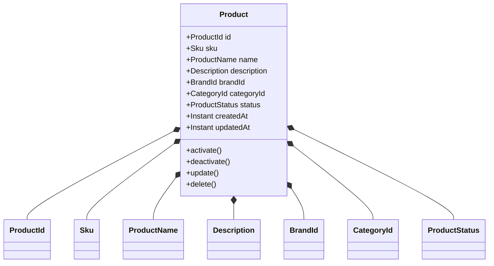

# Domain Model

> **AI-Commerce Platform**
>
> **Service:** Product Service  
> **Document:** Domain Model  
> **Version:** 1.0  
> **Status:** Active

---

# Purpose

This document describes the business domain of the **Product Service**.

It identifies the core business concepts, aggregate root, value objects, domain invariants and lifecycle rules that compose the Product Catalog domain.

The model follows the principles of **Domain-Driven Design (DDD)**, promoting a rich domain model where business rules remain encapsulated inside the Domain Layer and independent from infrastructure concerns.

---

# Domain Overview

The Product Service belongs to the **Product Catalog** bounded context.

Its primary responsibility is managing the lifecycle of products available within the AI-Commerce Platform.

The Product Aggregate encapsulates all business rules related to product management, ensuring consistency and protecting business invariants.

The Domain Layer is intentionally independent from frameworks, persistence technologies and external systems.

---

# Bounded Context

The **Product Service** owns the **Product Catalog** bounded context.

It is responsible for:

- Product lifecycle management
- Product information
- Product availability
- Product validation
- Product business rules

The Product Service owns its domain model and database.

Other services interact with the Product Service exclusively through APIs or asynchronous events.

---

# Domain Model



---

# Aggregate Summary

| Aggregate | Responsibility | Aggregate Root |
|------------|----------------|----------------|
| Product | Manage the complete product lifecycle | Product |

---

# Aggregate Root

## Product

The **Product** is the Aggregate Root of the Product Service.

All modifications to product data must occur through this aggregate.

### Responsibilities

- Protect business invariants
- Maintain aggregate consistency
- Coordinate business operations
- Encapsulate business rules
- Produce domain events
- Manage product lifecycle

The aggregate is responsible for ensuring that the domain always remains in a valid state before persistence.

---

# Value Objects

The Product Aggregate is composed of immutable Value Objects representing business concepts.

| Value Object | Responsibility |
|---------------|----------------|
| ProductId | Unique product identifier |
| Sku | Product stock keeping unit |
| ProductName | Product name |
| Description | Product description |
| BrandId | Brand reference |
| CategoryId | Category reference |
| ProductStatus | Product lifecycle status |

Characteristics:

- Immutable
- Equality by value
- Self-validation
- No identity

---

# Product Lifecycle

The Product Aggregate supports the following lifecycle.

```text
             Create Product
                    │
                    ▼
              Product Created
                    │
        ┌───────────┴───────────┐
        ▼                       ▼
 Activate Product       Update Product
        │                       │
        ▼                       ▼
 Product Active ◄───────────────┘
        │
        ▼
Deactivate Product
        │
        ▼
Product Inactive
        │
        ▼
 Delete Product
        │
        ▼
 Soft Deleted
```

Current business operations:

- Create Product
- Update Product
- Activate Product
- Deactivate Product
- Delete Product (Soft Delete)

---

# Domain Invariants

The Product Aggregate guarantees the following business invariants.

- ProductId is immutable.
- SKU must be unique.
- Product name cannot be empty.
- Product status must always be valid.
- Deleted products cannot be modified.
- Aggregate consistency must be validated before persistence.
- Business rules are enforced before any infrastructure interaction.

These invariants ensure that the Product Aggregate always remains in a consistent state.

---

# Business Rules

The Product Aggregate currently enforces the following business rules.

- Every product must have a valid identifier.
- Every product must have a valid SKU.
- Product names cannot be empty.
- Product descriptions must satisfy validation rules.
- Product status transitions must follow the defined lifecycle.
- Soft deleted products remain stored for historical purposes.
- Only active products should be available to customers.

Additional business rules will be introduced as the platform evolves.

---

# Domain Events

The Product Aggregate is designed to publish domain events whenever significant business actions occur.

Planned events include:

- ProductCreated
- ProductUpdated
- ProductActivated
- ProductDeactivated
- ProductDeleted

These events will enable asynchronous communication with other platform services.

---

# Ubiquitous Language

The following business terminology is used consistently throughout the Product Service.

| Business Term | Description |
|---------------|-------------|
| Product | Item available for sale |
| SKU | Stock Keeping Unit used to identify a product |
| Brand | Product manufacturer |
| Category | Product classification |
| Active Product | Product available for customers |
| Inactive Product | Product temporarily unavailable |
| Deleted Product | Soft deleted product retained for historical purposes |

---

# Domain Principles

The Product Domain follows the principles below.

- Domain-Driven Design (DDD)
- Rich Domain Model
- Ubiquitous Language
- Persistence Ignorance
- High Cohesion
- Low Coupling
- Framework Independence
- Encapsulation of Business Rules

---

# Applied Design Patterns

The Product Domain adopts the following design patterns.

- Aggregate Root
- Value Object
- Repository
- Factory
- Domain Event
- Rich Domain Model

---

# Design Decisions

The Product Aggregate was designed according to the following architectural decisions.

- Single Aggregate Root per consistency boundary.
- Business rules remain inside the domain.
- Value Objects encapsulate business concepts.
- Infrastructure dependencies are isolated through Ports.
- Aggregate consistency is validated before persistence.
- The Domain Layer has no dependency on Spring Framework or persistence technologies.

---

# Future Evolution

The Product Aggregate has been designed to evolve without breaking existing business rules.

Future concepts may include:

## Planned Entities

- ProductImage
- ProductVariant
- ProductAttribute
- ProductSpecification

## Planned Value Objects

- Money
- Weight
- Dimensions
- Barcode
- Slug

The aggregate boundary will remain stable while supporting new business capabilities.

---

# Related ADRs

- ADR-001 — Hexagonal Architecture
- ADR-002 — Domain-Driven Design
- ADR-006 — Soft Delete

---

# Related Documents

- C3 — Component Diagram
- System Architecture
- Hexagonal Architecture
- Sequence Diagrams
- Architecture Decision Records (ADR)