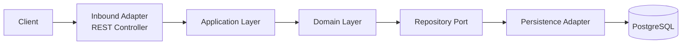

# Hexagonal Architecture

> **AI-Commerce Platform**
>
> **Service:** Product Service  
> **Document:** Hexagonal Architecture  
> **Version:** 1.0  
> **Status:** Active

---

# Purpose

This document describes how the Product Service implements the **Hexagonal Architecture (Ports & Adapters)**.

The objective of this architectural style is to isolate the business domain from infrastructure concerns, allowing the application to evolve independently from frameworks, databases and external technologies.

The Product Service follows the Dependency Inversion Principle, ensuring that the Domain Layer depends only on abstractions.

---

# Architectural Overview

The Product Service is organized around the business domain.

External technologies communicate with the application exclusively through adapters.

The Domain Layer never depends on infrastructure components.

Instead, it communicates through well-defined ports.

This architecture promotes:

- Framework Independence
- Testability
- Maintainability
- Extensibility
- Low Coupling
- High Cohesion

---

# Hexagonal Diagram



---

# Architectural Flow

```
Client

↓

Inbound Adapter

↓

Application Layer

↓

Domain Layer

↓

Outbound Port

↓

Outbound Adapter

↓

Database
```

Business rules remain completely isolated from infrastructure.

---

# Inbound Adapters

Inbound Adapters receive requests from external clients.

Current adapters include:

| Adapter | Technology |
|----------|------------|
| REST Controller | Spring MVC |

Responsibilities:

- Receive HTTP requests
- Validate input
- Convert requests into application commands
- Invoke use cases
- Return HTTP responses

---

# Application Layer

The Application Layer coordinates business workflows.

Responsibilities:

- Execute use cases
- Coordinate business operations
- Manage transactions
- Invoke domain objects
- Communicate with outbound ports

This layer contains application logic but no business rules.

---

# Domain Layer

The Domain Layer represents the business core of the Product Service.

Responsibilities:

- Business Rules
- Product Aggregate
- Value Objects
- Domain Events
- Domain Services
- Factories

Characteristics:

- Framework Independent
- Persistence Ignorant
- Rich Domain Model
- Highly Testable

The Domain Layer has no dependency on Spring Framework or infrastructure technologies.

---

# Outbound Ports

Outbound Ports define contracts required by the Domain Layer.

Current ports:

- ProductRepositoryPort

Planned ports:

- EventPublisherPort
- CachePort
- SearchPort
- AIRecommendationPort

The Domain Layer depends only on these abstractions.

---

# Outbound Adapters

Outbound Adapters implement outbound ports.

Current adapter:

| Adapter | Technology |
|----------|------------|
| Persistence Adapter | Spring Data JPA |

Future adapters:

- Kafka Adapter
- Redis Adapter
- Elasticsearch Adapter
- AI Adapter

Adapters may evolve without impacting the Domain Layer.

---

# Infrastructure

Infrastructure components provide technical capabilities required by the application.

Current infrastructure:

- PostgreSQL

Planned infrastructure:

- Redis
- Apache Kafka
- OpenTelemetry
- Prometheus
- Grafana
- Kubernetes
- AWS

Infrastructure never contains business rules.

---

# Dependency Rules

The Product Service follows the Dependency Inversion Principle.

Allowed dependency direction:

```
Inbound Adapters

↓

Application Layer

↓

Domain Layer

↓

Outbound Ports

↓

Outbound Adapters

↓

Infrastructure
```

The Domain Layer must never depend on:

- Spring Boot
- Spring Framework
- Spring Data JPA
- Hibernate
- PostgreSQL
- Kafka
- Redis
- REST Controllers

---

# Package Mapping

| Layer | Package |
|---------|---------|
| Inbound Adapters | adapters.inbound |
| Application Layer | application |
| Domain Layer | domain |
| Outbound Ports | domain.ports |
| Outbound Adapters | adapters.outbound |
| Infrastructure | infrastructure |

---

# Benefits

The adoption of Hexagonal Architecture provides several advantages.

- Independent business logic
- Easier unit testing
- Replaceable infrastructure
- Improved maintainability
- Better separation of concerns
- Simplified integration with external systems

---

# Trade-offs

Like any architectural style, Hexagonal Architecture introduces trade-offs.

Advantages:

- High flexibility
- Excellent testability
- Clear dependency direction
- Framework independence

Challenges:

- Increased number of classes
- Additional abstraction layers
- Higher learning curve
- More initial design effort

These trade-offs are acceptable for enterprise systems where maintainability and long-term evolution are priorities.

---

# Future Evolution

The current architecture allows new adapters to be introduced without changing the Domain Layer.

Future integrations include:

### Infrastructure

- Redis Cache Adapter
- Kafka Event Adapter
- Elasticsearch Adapter

### Cloud

- AWS S3 Adapter
- AWS SNS Adapter
- AWS SQS Adapter

### Artificial Intelligence

- Amazon Bedrock Adapter
- Embedding Adapter
- Vector Database Adapter

---

# Related ADRs

- ADR-001 — Hexagonal Architecture
- ADR-002 — Domain-Driven Design
- ADR-003 — Repository Pattern

---

# Related Documents

- System Architecture
- C3 — Component Diagram
- Domain Model
- Deployment Diagram
- Sequence Diagrams
- Architecture Decision Records (ADR)