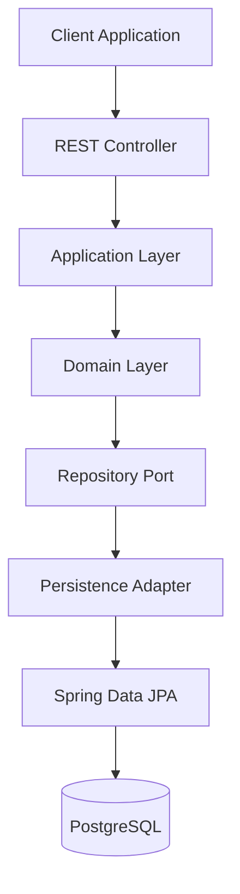

# System Architecture

> **AI-Commerce Platform**
>
> **Service:** Product Service  
> **Document:** System Architecture  
> **Version:** 1.0  
> **Status:** Active

---

# Purpose

This document provides a high-level architectural view of the **Product Service**.

It explains how the architectural layers collaborate to process requests while enforcing the principles of Domain-Driven Design (DDD), Hexagonal Architecture and Clean Architecture.

Unlike the C4 diagrams, this document focuses on the architectural organization of the service rather than deployment or system boundaries.

---

# Architectural Overview

The Product Service is implemented as a layered, domain-centric application.

Business rules remain isolated from infrastructure concerns through the use of Ports and Adapters.

The architecture promotes:

- Separation of Concerns
- High Cohesion
- Low Coupling
- Framework Independence
- Testability
- Maintainability

The Domain Layer represents the core of the application and has no dependency on Spring Framework or persistence technologies.

---

# Architecture Diagram



---

# Request Processing Flow

A typical request follows the sequence below:

```
Client

↓

REST Controller

↓

Application Layer

↓

Domain Layer

↓

Repository Port

↓

Persistence Adapter

↓

Spring Data JPA

↓

PostgreSQL
```

Business rules are executed entirely inside the Domain Layer before any interaction with external infrastructure occurs.

---

# Architectural Layers

## Client

Represents external consumers of the Product Service.

Examples include:

- Customer Frontend
- Admin Frontend
- API Gateway
- Integration Tests

---

## REST Controller

Receives HTTP requests and exposes RESTful endpoints.

Responsibilities:

- Request validation
- HTTP serialization
- Response generation
- Delegation to the Application Layer

Technology:

- Spring MVC
- Bean Validation
- Jackson

---

## Application Layer

Coordinates application workflows.

Responsibilities:

- Execute use cases
- Manage transactions
- Coordinate business operations
- Invoke Domain Model
- Interact with outbound ports

This layer contains application logic but no business rules.

---

## Domain Layer

Represents the business core of the application.

Responsibilities:

- Business Rules
- Product Aggregate
- Value Objects
- Domain Events
- Factories
- Domain Exceptions

Characteristics:

- Framework Independent
- Persistence Ignorant
- Rich Domain Model

---

## Repository Port

Defines persistence contracts required by the Domain Layer.

The domain depends only on abstractions.

Current Port:

- ProductRepositoryPort

Future Ports:

- EventPublisherPort
- CachePort
- SearchPort

---

## Persistence Adapter

Implements outbound ports using infrastructure technologies.

Responsibilities:

- Repository implementation
- Entity persistence
- Mapping
- Database communication

Technology:

- Spring Data JPA
- Hibernate

---

## PostgreSQL

Stores all product-related information.

The Product Service exclusively owns this database following the **Database per Service** pattern.

---

# Architectural Principles

The Product Service follows the architectural standards adopted by the AI-Commerce Platform.

- Domain-Driven Design (DDD)
- Hexagonal Architecture
- Clean Architecture
- SOLID Principles
- Dependency Inversion Principle
- Rich Domain Model
- Database per Service

---

# Dependency Rules

Dependencies always point toward the Domain Layer.

Allowed dependency direction:

```
Client

↓

REST Controller

↓

Application Layer

↓

Domain Layer

↓

Repository Port

↓

Persistence Adapter

↓

Infrastructure
```

The Domain Layer must never depend on:

- Spring Boot
- Spring Framework
- Spring Data JPA
- Hibernate
- PostgreSQL
- REST Controllers
- Infrastructure Adapters

---

# Quality Attributes

The current architecture was designed to support the following quality attributes:

| Attribute | Description |
|------------|-------------|
| Maintainability | Clear separation of responsibilities |
| Testability | Independent business logic |
| Scalability | Ready for cloud-native deployment |
| Modularity | Independent architectural layers |
| Extensibility | Easy integration with new adapters |
| Flexibility | Infrastructure can evolve without impacting the domain |

---

# Future Evolution

The current architecture allows the introduction of additional infrastructure without changing the Domain Layer.

Planned integrations include:

### Infrastructure

- Redis Cache
- Apache Kafka
- OpenTelemetry
- Prometheus
- Grafana

### Cloud

- Docker
- Kubernetes
- AWS

### Artificial Intelligence

- AI Recommendation Engine
- Embedding Service
- Vector Database Integration

---

# Related Documents

- C1 — System Context
- C2 — Container Diagram
- C3 — Component Diagram
- Hexagonal Architecture
- Domain Model
- Sequence Diagrams
- Deployment Diagram
- Architecture Decision Records (ADR)