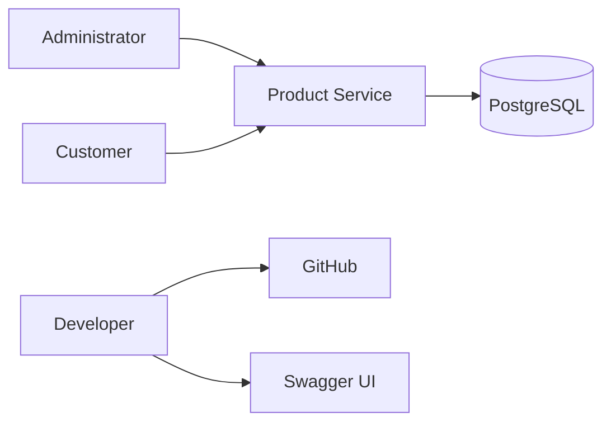

# C1 - System Context

## Description

The Product Service is responsible for managing products within the AI-Commerce platform.

External users interact through REST APIs.

Persistence is handled by PostgreSQL.

Source code is managed using GitHub.