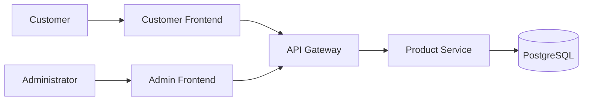

# C1 — System Context

> **AI-Commerce Platform**
>
> **Service:** Product Service  
> **Document:** C1 - System Context  
> **Version:** 1.0  
> **Status:** Active

---

## Purpose

The Product Service is responsible for managing the product catalog within the AI-Commerce Platform.

It exposes REST APIs that allow administrators and platform applications to create, update, retrieve and remove products.

This document describes the Product Service in its operational context, identifying its users, responsibilities and external interactions.

---

## Scope

This document describes only the **Product Service**.

The complete AI-Commerce Platform will include additional microservices that will be documented as they are implemented.

---

## Primary Responsibilities

- Manage product information
- Expose REST APIs
- Validate business rules
- Persist product data
- Publish domain events *(future)*
- Provide product data to other platform services

---

## Actors

### Administrator

Responsible for managing the product catalog.

Typical actions:

- Create products
- Update products
- Delete products

---

### Customer

Uses the AI-Commerce Platform to browse products and make purchases.

Typical actions:

- Browse products
- Search products
- View product details

---

## External Systems

### API Gateway

Acts as the single entry point for all client applications and routes requests to the Product Service.

---

### PostgreSQL

Stores all product information.

The Product Service owns its database following the **Database per Service** pattern.

---

## Context Diagram

---

## Relationships

| Source | Target | Description |
|----------|----------|-------------|
| Customer | Customer Frontend | Uses the e-commerce platform |
| Administrator | Admin Frontend | Manages the product catalog |
| Customer Frontend | API Gateway | Sends REST requests |
| Admin Frontend | API Gateway | Sends REST requests |
| API Gateway | Product Service | Routes product-related requests |
| Product Service | PostgreSQL | Persists product data |

---

## Current Architecture

### Implemented

- ✅ Product Service

---

### Planned Services

- Authentication Service
- Inventory Service
- Pricing Service
- Order Service
- Payment Service
- Recommendation AI Service
- Notification Service
- Search Service

---

## Supporting Infrastructure *(Roadmap)*

- Apache Kafka
- Redis
- OpenTelemetry
- Prometheus
- Grafana
- Kubernetes
- AWS

---

## Architecture Principles

The Product Service follows the architectural standards adopted by the AI-Commerce Platform:

- Domain-Driven Design (DDD)
- Hexagonal Architecture
- Clean Architecture
- SOLID Principles
- Database per Service
- API First Design
- Cloud-Native Ready

---

## Related Documents

- C2 — Container Diagram
- C3 — Component Diagram
- Hexagonal Architecture
- Deployment Diagram
- Sequence Diagrams
- Architecture Decision Records (ADR)