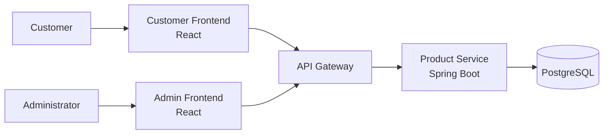

# C2 — Container Diagram

> **AI-Commerce Platform**
>
> **Service:** Product Service  
> **Document:** C2 - Container Diagram  
> **Version:** 1.0  
> **Status:** Active

---

## Purpose

This document describes the deployable containers that compose the Product Service and how they interact with external applications and infrastructure.

---

## Containers

### Customer Frontend

Web application used by customers to browse products and make purchases.

**Technology**

- React *(planned)*

---

### Admin Frontend

Administrative portal used to manage the product catalog.

**Technology**

- React *(planned)*

---

### API Gateway

Single entry point for all client applications.

Responsible for routing requests to the appropriate microservices.

---

### Product Service

Spring Boot microservice responsible for managing the product catalog.

**Technology**

- Java 21
- Spring Boot 3.5

---

### PostgreSQL

Stores all product data.

Each microservice owns its own database.

---

## Container Diagram

---

## Relationships

| Source | Target | Description |
|---------|---------|-------------|
| Customer | Customer Frontend | Uses the platform |
| Administrator | Admin Frontend | Manages products |
| Customer Frontend | API Gateway | Sends REST requests |
| Admin Frontend | API Gateway | Sends REST requests |
| API Gateway | Product Service | Routes requests |
| Product Service | PostgreSQL | Reads and writes product data |

---

## Technologies

| Container | Technology |
|------------|------------|
| Customer Frontend | React *(planned)* |
| Admin Frontend | React *(planned)* |
| API Gateway | Spring Cloud Gateway *(planned)* |
| Product Service | Java 21 + Spring Boot 3.5 |
| Database | PostgreSQL 16 |

---

## Notes

The Product Service is implemented as a single Spring Boot application.

Its internal structure (Controllers, Use Cases, Domain Model, Ports and Adapters) is described in the **C3 – Component Diagram**.