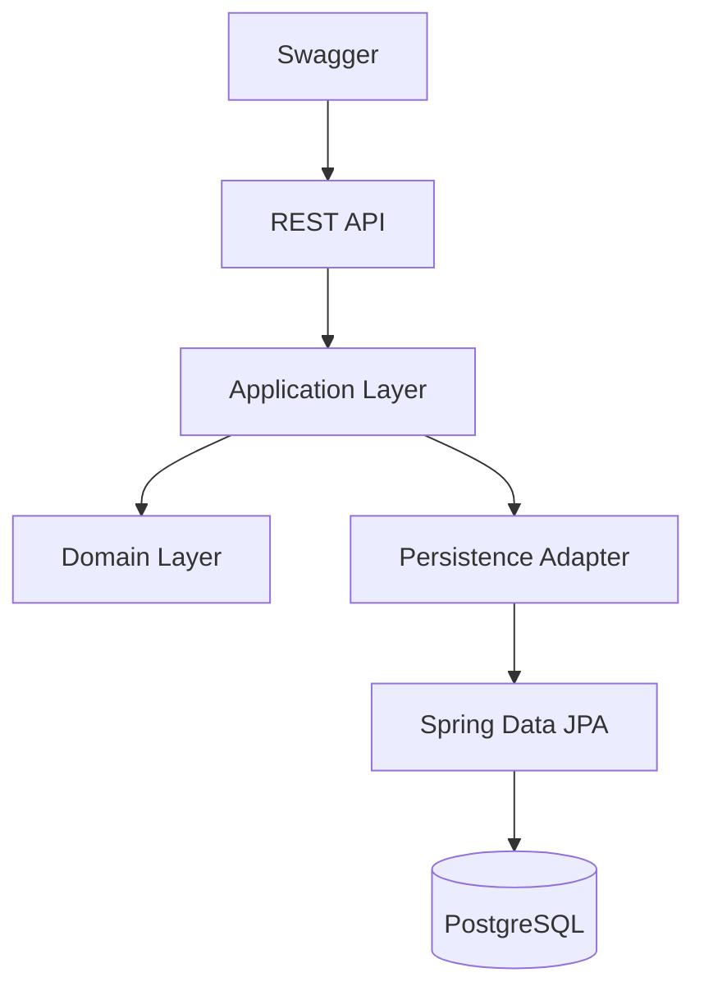

# C2 - Container Diagram

## Containers

### REST API

Spring MVC Controllers.

### Application

Use Cases.

### Domain

Business Rules.

### Persistence

Outbound Adapter.

### PostgreSQL

Persistent storage.