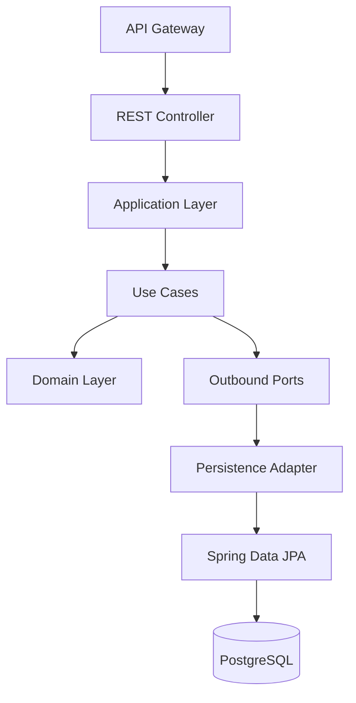

# C3 — Component Diagram

> **AI-Commerce Platform**
>
> **Service:** Product Service  
> **Document:** C3 - Component Diagram  
> **Version:** 1.0  
> **Status:** Active

---

# Purpose

This document describes the internal structure of the **Product Service**.

It identifies the major software components, their responsibilities, dependencies and interactions.

The service follows the principles of:

- Domain-Driven Design (DDD)
- Hexagonal Architecture (Ports & Adapters)
- Clean Architecture
- SOLID Principles

This document complements the **C2 - Container Diagram** by describing the internal composition of the Product Service.

---

# Architectural Overview

The Product Service is implemented as a single Spring Boot application.

Internally, the application is divided into logical components that separate business rules from infrastructure concerns.

The architecture follows the Dependency Inversion Principle, ensuring that the Domain Layer remains completely independent of frameworks and external technologies.

---

# Component Diagram



---

# Components

## REST Controller

### Purpose

Acts as the entry point of the Product Service by exposing RESTful APIs.

Controllers translate HTTP requests into application commands and return standardized HTTP responses.

### Responsibilities

- Receive HTTP requests
- Validate request payloads
- Invoke application use cases
- Convert domain responses into HTTP responses
- Handle validation errors
- Return standardized status codes

### Technologies

- Spring MVC
- Bean Validation
- Jackson
- OpenAPI / Swagger

### Dependencies

- Application Layer

### Package

```
adapters.inbound
```

---

## Application Layer

### Purpose

Coordinates business workflows without implementing business rules.

The Application Layer orchestrates use cases and manages application transactions.

### Responsibilities

- Execute use cases
- Coordinate business operations
- Manage transactions
- Convert DTOs
- Invoke Domain Model
- Invoke outbound ports

### Technologies

- Spring Boot
- Spring Transaction Management

### Dependencies

- Domain Layer
- Outbound Ports

### Package

```
application
```

---

## Use Cases

### Purpose

Represent the application business operations.

Each use case encapsulates a single business capability.

### Current Use Cases

- Create Product
- Update Product
- Delete Product
- Find Product
- List Products

### Responsibilities

- Execute application workflows
- Coordinate domain objects
- Invoke repository ports
- Publish domain events (future)

### Package

```
application.command
application.query
```

---

## Domain Layer

### Purpose

Contains the core business logic of the Product Service.

The Domain Layer is the heart of the application and remains completely independent from frameworks and infrastructure.

### Responsibilities

- Product Aggregate
- Business Rules
- Domain Events
- Value Objects
- Domain Exceptions
- Domain Factories
- Rich Domain Model

### Characteristics

- Framework Independent
- Persistence Ignorant
- Highly Testable
- Rich Domain Model

### Dependencies

None

### Package

```
domain
```

---

## Outbound Ports

### Purpose

Define contracts used by the Domain Layer to communicate with external systems.

Ports provide abstraction between the business logic and infrastructure.

### Responsibilities

- Repository contracts
- Event Publisher contracts
- External Service contracts

### Current Ports

- ProductRepositoryPort

### Planned Ports

- EventPublisherPort
- CachePort
- SearchPort
- AIRecommendationPort

### Package

```
domain.ports
```

---

## Persistence Adapter

### Purpose

Implements outbound ports using Spring Data JPA.

Responsible for translating domain operations into persistence operations.

### Responsibilities

- Repository implementation
- Entity persistence
- Database communication
- Mapping between entities and domain models

### Technologies

- Spring Data JPA
- Hibernate

### Dependencies

- Spring Data JPA
- PostgreSQL

### Package

```
adapters.outbound
```

---

## Spring Data JPA

### Purpose

Provides the persistence abstraction layer used by the Persistence Adapter.

### Responsibilities

- CRUD operations
- Query execution
- Entity management
- Transaction support

### Technologies

- Spring Data JPA
- Hibernate

---

## PostgreSQL

### Purpose

Stores all Product Service data.

The Product Service exclusively owns its database following the **Database per Service** pattern.

### Responsibilities

- Product persistence
- Transaction management
- ACID guarantees

### Technology

- PostgreSQL 16

---

# Component Interaction

The following sequence represents the execution flow of a typical request.

```
HTTP Request

↓

REST Controller

↓

Application Layer

↓

Use Case

↓

Domain Model

↓

Repository Port

↓

Persistence Adapter

↓

Spring Data JPA

↓

PostgreSQL
```

---

# Dependency Rules

The Product Service follows the Dependency Inversion Principle.

Allowed dependencies:

```
REST Controller

↓

Application Layer

↓

Use Cases

↓

Domain Layer

↓

Ports

↓

Infrastructure
```

The Domain Layer **must never depend on**:

- Spring Framework
- Spring Boot
- Spring Data JPA
- Hibernate
- PostgreSQL
- REST Controllers
- Infrastructure Adapters

---

# Package Mapping

| Component | Package |
|------------|---------|
| REST Controller | adapters.inbound |
| Application Layer | application |
| Use Cases | application.command / application.query |
| Domain Layer | domain |
| Outbound Ports | domain.ports |
| Persistence Adapter | adapters.outbound |
| Spring Data JPA | adapters.outbound.jpa |

---

# Architecture Decisions

The Product Service adopts the following architectural decisions:

- Hexagonal Architecture to isolate the Domain Layer from infrastructure concerns.
- Domain-Driven Design to model the business domain.
- Clean Architecture to enforce dependency direction.
- Rich Domain Model to encapsulate business rules.
- Database per Service to ensure microservice autonomy.
- Dependency Inversion Principle to decouple business logic from implementations.

---

# Future Evolution

The following components will be introduced in future iterations.

### Infrastructure

- Redis Cache Adapter
- Kafka Event Publisher
- OpenTelemetry Adapter
- Metrics Adapter

### Artificial Intelligence

- AI Recommendation Client
- Vector Database Adapter

### Search

- Elasticsearch Adapter

---

# Related Documents

- C1 — System Context
- C2 — Container Diagram
- Hexagonal Architecture
- Domain Model
- Sequence Diagrams
- Deployment Diagram
- Security Architecture
- Architecture Decision Records (ADR)