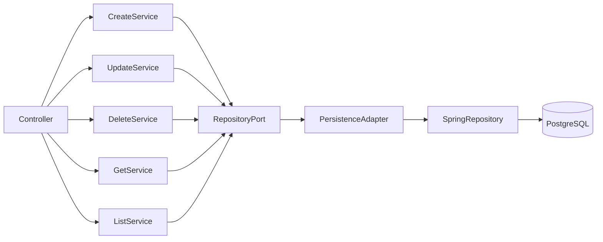

# C3 - Product Service Components

## Components

### Controller

REST Endpoints.

### Services

Application Use Cases.

### Repository Port

Application abstraction.

### Persistence Adapter

Infrastructure implementation.

### Spring Data Repository

JPA Repository.

### PostgreSQL

Database.