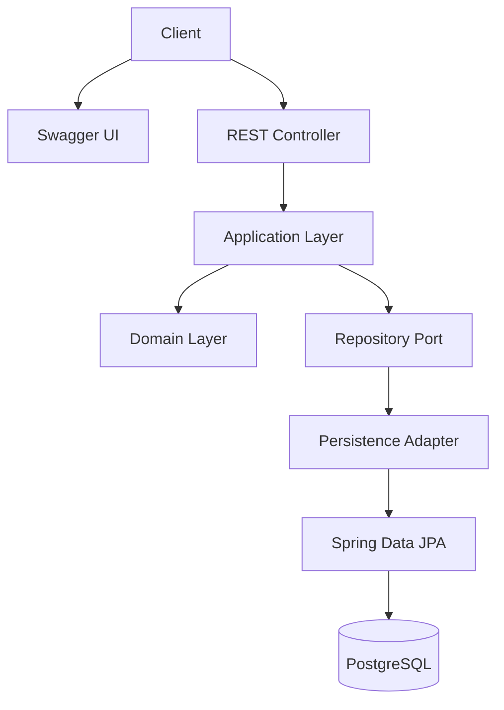

# System Architecture

```mermaid
flowchart TB

Client[Client]

Swagger[Swagger UI]

Controller[REST Controller]

Application[Application Layer]

Domain[Domain Layer]

Port[Repository Port]

Adapter[Persistence Adapter]

JPA[Spring Data JPA]

DB[(PostgreSQL)]

Client --> Swagger

Client --> Controller

Controller --> Application

Application --> Domain

Application --> Port

Port --> Adapter

Adapter --> JPA

JPA --> DB
```