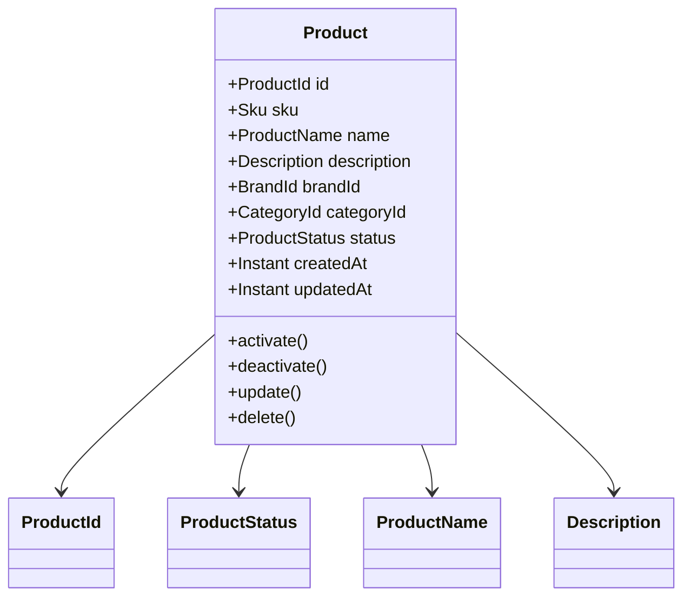

# Domain Model

```mermaid
classDiagram

class Product{

+ProductId id

+Sku sku

+ProductName name

+Description description

+BrandId brandId

+CategoryId categoryId

+ProductStatus status

+Instant createdAt

+Instant updatedAt

+activate()

+deactivate()

+update()

+delete()

}

class ProductId

class ProductStatus

class ProductName

class Description

Product --> ProductId

Product --> ProductStatus

Product --> ProductName

Product --> Description
```