# Contribution Workflow

> **AI-Commerce Platform**
>
> **Service:** Product Service  
> **Document:** Contribution Workflow  
> **Version:** 1.0  
> **Status:** Active

---

# Purpose

This document describes the standard contribution workflow adopted by the Product Service.

The objective is to establish a consistent development process that ensures code quality, traceability and collaboration across all contributors.

The workflow integrates GitHub Issues, feature branches, Pull Requests, automated validation pipelines and code reviews before changes are merged into the main branches.

---

# Scope

This workflow applies to every contribution made to the Product Service repository, including:

- New features
- Bug fixes
- Refactoring
- Documentation
- CI/CD improvements
- Infrastructure changes
- Security enhancements

---

# Workflow Overview

```mermaid
flowchart LR

Issue["GitHub Issue"]

Branch["Feature Branch"]

Development["Development"]

Commit["Git Commit"]

Push["Git Push"]

PR["Pull Request"]

CI["GitHub Actions"]

Review["Code Review"]

Merge["Merge"]

Main["Main Branch"]

Issue --> Branch

Branch --> Development

Development --> Commit

Commit --> Push

Push --> PR

PR --> CI

CI --> Review

Review --> Merge

Merge --> Main
```



---

# Contribution Flow

| Step | Description |
|------|-------------|
| 1 | Create or select a GitHub Issue. |
| 2 | Create a feature branch from the appropriate base branch. |
| 3 | Implement the requested changes. |
| 4 | Commit changes using meaningful commit messages. |
| 5 | Push the branch to GitHub. |
| 6 | Open a Pull Request. |
| 7 | Execute automated validation pipelines. |
| 8 | Perform code review. |
| 9 | Merge after approval. |

---

# Branch Strategy

The repository adopts the following branch structure.

| Branch | Purpose |
|---------|---------|
| main | Production-ready code |
| develop | Integration branch |
| feature/* | New features |
| bugfix/* | Bug fixes |
| hotfix/* | Production fixes |

Example:

```text
main

↓

develop

↓

feature/product-search

↓

Pull Request

↓

develop

↓

main
```

---

# Pull Request Process

Every Pull Request must include:

- Clear description
- Related issue
- Type of change
- Updated documentation (when applicable)
- Successful CI execution
- Passing automated tests

The Pull Request template standardizes this information across all contributions.

---

# Code Review

Every Pull Request should be reviewed before merging.

The review verifies:

- Code readability
- Architectural consistency
- Business rules
- Test coverage
- Documentation updates
- Security considerations

---

# Continuous Integration

Every Pull Request automatically executes the Continuous Integration pipeline.

Validation includes:

- Build
- Unit Tests
- Integration Tests
- JaCoCo Coverage
- SonarCloud Analysis

Pull Requests should only be merged after successful pipeline execution.

---

# Issue Management

Development work starts with a GitHub Issue.

Supported issue types include:

- Bug Report
- Feature Request

Questions and discussions should be handled through GitHub Discussions.

---

# Commit Guidelines

Commits should be:

- Small
- Atomic
- Descriptive
- Focused on a single logical change

Example:

```text
feat(product): add product search by SKU

fix(validation): prevent duplicated SKU

refactor(domain): simplify aggregate validation

docs(c4): update component diagram
```

---

# Architectural Principles

The contribution workflow reinforces the architectural standards adopted by the Product Service.

### Code Quality

All contributions must preserve readability, maintainability and consistency.

---

### Continuous Validation

Every change is validated automatically before merge.

---

### Documentation First

Architecture changes must be reflected in the corresponding documentation.

---

### Testability

New functionality should include appropriate automated tests.

---

### Traceability

Every significant change should be traceable through:

- GitHub Issue
- Commit History
- Pull Request
- CI Pipeline

---

# Future Evolution

As the AI-Commerce Platform evolves, the contribution workflow may incorporate additional stages.

```text
Issue
      │
      ▼
Feature Branch
      │
      ▼
Development
      │
      ▼
Pull Request
      │
      ▼
CI Pipeline
      │
      ▼
Security Analysis
      │
      ▼
Code Review
      │
      ▼
Container Build
      │
      ▼
Kubernetes Deployment
      │
      ▼
Production
```

This evolution will strengthen the platform's DevSecOps practices while preserving software quality and governance.

---

# Related Documents

- GitHub Workflows
- Issue Management
- Pull Request Process
- Sequence Diagram — Continuous Integration Pipeline
- Sequence Diagram — CodeQL Security Analysis