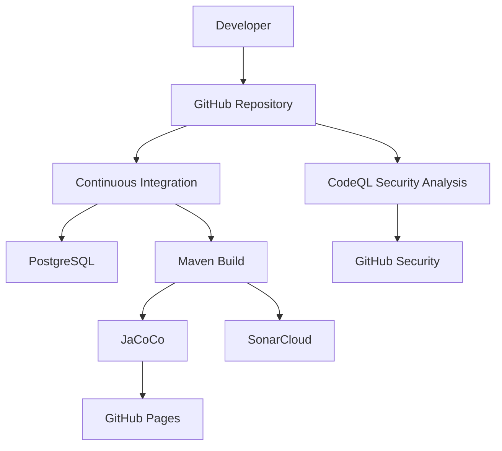

# GitHub Workflows

> **AI-Commerce Platform**
>
> **Service:** Product Service  
> **Document:** GitHub Workflows  
> **Version:** 1.0  
> **Status:** Active

---

# Purpose

This document describes the GitHub Actions workflows adopted by the Product Service.

The workflows automate Continuous Integration (CI), static code analysis and security validation, ensuring that every code change is automatically verified before becoming part of the main codebase.

The automation strategy supports the platform's Software Engineering, DevSecOps and Continuous Delivery practices.

---

# Scope

The Product Service currently defines the following GitHub Actions workflows.

```text
.github/
└── workflows/
    ├── ci.yml
    └── codeql.yml
```

Each workflow is responsible for a specific aspect of the software delivery lifecycle.

---

# Workflow Overview



---

# Workflow Responsibilities

| Workflow | Responsibility |
|----------|----------------|
| `ci.yml` | Continuous Integration |
| `codeql.yml` | Static Security Analysis |

---

# Continuous Integration Workflow

The Continuous Integration workflow validates every code change.

Main responsibilities:

- Checkout repository
- Configure Java 21
- Provision PostgreSQL
- Build the application
- Execute unit tests
- Execute integration tests
- Generate JaCoCo reports
- Execute SonarCloud analysis
- Publish coverage reports

Execution triggers:

- Push to `main`
- Push to `develop`
- Push to `feature/**`
- Pull Request to `main`
- Pull Request to `develop`

---

# CodeQL Security Workflow

The CodeQL workflow performs automated security analysis of the source code.

Main responsibilities:

- Checkout repository
- Configure Java 21
- Initialize CodeQL
- Compile the project
- Analyze Java source code
- Publish security findings

Execution triggers:

- Push to `main`
- Push to `develop`
- Pull Request
- Weekly scheduled scan

---

# Workflow Architecture

```text
Developer
      │
      ▼
GitHub Repository
      │
      ▼
GitHub Actions
      │
      ├───────────────┐
      ▼               ▼
CI Pipeline      CodeQL Analysis
      │               │
      ▼               ▼
Build         Security Analysis
      │
      ▼
Tests
      │
      ▼
Coverage
      │
      ▼
SonarCloud
      │
      ▼
Published Reports
```

---

# Toolchain

| Tool | Purpose |
|------|---------|
| GitHub Actions | Workflow orchestration |
| Maven | Build automation |
| PostgreSQL | Integration test database |
| JaCoCo | Code coverage |
| SonarCloud | Static code quality analysis |
| GitHub Pages | Coverage report publication |
| CodeQL | Static security analysis |

---

# Quality Gates

Every contribution is automatically validated through:

- Successful project compilation
- Unit test execution
- Integration test execution
- Code coverage generation
- Static code analysis
- Security analysis

A Pull Request should only be merged after all required validations have completed successfully.

---

# Architectural Decisions

## Continuous Integration

Every code change is automatically validated before merge.

---

## Shift Left Testing

Testing is executed during development rather than after deployment.

---

## Shift Left Security

Security analysis is integrated directly into the development lifecycle.

---

## Automation First

Manual validation steps are minimized through automated workflows.

---

## Continuous Feedback

Developers receive immediate feedback regarding:

- Build failures
- Test failures
- Code quality issues
- Security vulnerabilities

---

# Operational Considerations

The GitHub Actions runners execute on Ubuntu Linux.

Workflow execution includes:

- Temporary PostgreSQL provisioning
- Maven dependency caching
- Automatic artifact generation
- Secure secret management
- Parallel workflow execution

---

# Future Evolution

The workflow architecture has been designed to support additional DevSecOps stages.

```text
GitHub

↓

CI Pipeline

↓

Unit Tests

↓

Integration Tests

↓

JaCoCo

↓

SonarCloud

↓

CodeQL

↓

OWASP Dependency Check

↓

Trivy Container Scan

↓

Docker Image Build

↓

Container Registry

↓

Kubernetes Deployment

↓

Production
```

Future workflows may include:

- Docker image publishing
- Kubernetes deployment
- Infrastructure validation
- Terraform validation
- Container security scanning
- SBOM generation
- Dependency Review
- Release automation

---

# Related Documents

- Sequence Diagram — Continuous Integration Pipeline
- Sequence Diagram — CodeQL Security Analysis
- Contribution Workflow
- Pull Request Process
- Issue Management
- Deployment Diagram