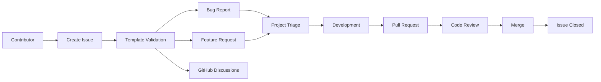

# Issue Management

> **AI-Commerce Platform**
>
> **Service:** Product Service  
> **Document:** Issue Management  
> **Version:** 1.0  
> **Status:** Active

---

# Purpose

This document defines the issue management process adopted by the Product Service repository.

The objective is to standardize how bugs, feature requests and discussions are reported, prioritized and tracked throughout the software development lifecycle.

A consistent issue management process improves collaboration, traceability and planning while supporting continuous software evolution.

---

# Scope

The Product Service currently adopts the following GitHub issue templates.

```text
.github/

└── ISSUE_TEMPLATE
    ├── bug_report.md
    ├── feature_request.md
    └── config.yml
```

The repository also enables GitHub Discussions for questions and general conversations.

---

# Issue Management Workflow



---

# Issue Types

The repository currently supports the following issue categories.

| Type | Purpose |
|------|---------|
| Bug Report | Report defects or unexpected behavior |
| Feature Request | Propose new functionality |
| GitHub Discussions | Questions, ideas and technical discussions |

---

# Bug Reports

Bug reports should describe reproducible problems affecting the Product Service.

Each report should include:

- Clear description
- Reproduction steps
- Expected behavior
- Actual behavior
- Environment information
- Additional logs or screenshots (when applicable)

The objective is to provide enough information for efficient troubleshooting.

---

# Feature Requests

Feature requests document proposed improvements to the Product Service.

Each request should include:

- Feature description
- Business motivation
- Proposed implementation
- Alternative approaches
- Additional context

Feature requests are evaluated according to the platform roadmap and architectural guidelines.

---

# GitHub Discussions

Questions that do not represent defects or feature requests should be created as GitHub Discussions.

Typical discussion topics include:

- Usage questions
- Architectural decisions
- Design proposals
- Best practices
- Community feedback

This approach keeps the issue tracker focused on actionable work items.

---

# Issue Lifecycle

Every issue follows a defined lifecycle.

```text
Open
   │
   ▼
Under Review
   │
   ▼
Accepted
   │
   ▼
In Progress
   │
   ▼
Pull Request
   │
   ▼
Code Review
   │
   ▼
Merged
   │
   ▼
Closed
```

---

# Labels

Labels classify issues according to their purpose.

Current labels include:

| Label | Description |
|--------|-------------|
| bug | Defect or unexpected behavior |
| enhancement | New functionality or improvement |

Additional labels may be introduced as the platform evolves.

Examples include:

- documentation
- security
- performance
- refactoring
- dependencies
- testing
- ci/cd

---

# Issue Triage

Every new issue should be reviewed before implementation.

The triage process verifies:

- Reproducibility
- Completeness
- Business impact
- Priority
- Scope
- Alignment with the platform architecture

Only validated issues proceed to implementation.

---

# Best Practices

Contributors should follow these recommendations.

- Search for existing issues before creating a new one.
- Use the appropriate issue template.
- Provide complete and accurate information.
- Keep discussions focused on the reported topic.
- Update issues when new information becomes available.

---

# Architectural Decisions

## Standardized Templates

All issues use predefined templates to ensure consistency.

---

## Traceability

Every implementation should be linked to a corresponding GitHub Issue whenever possible.

---

## Separation of Concerns

Questions and technical discussions are handled through GitHub Discussions rather than Issues.

---

## Repository Governance

Issue templates establish a consistent contribution experience across the AI-Commerce Platform.

---

# Future Evolution

As the AI-Commerce Platform expands, the issue management process may incorporate:

- Priority labels
- Severity classification
- Automated issue assignment
- Release milestone tracking
- Project boards
- Service ownership labels
- AI-assisted issue categorization

These improvements will strengthen repository governance while maintaining a scalable development process.

---

# Related Documents

- Contribution Workflow
- Pull Request Process
- GitHub Workflows
- Sequence Diagram — Continuous Integration Pipeline
- Sequence Diagram — CodeQL Security Analysis