# Pull Request Process

> **AI-Commerce Platform**
>
> **Service:** Product Service  
> **Document:** Pull Request Process  
> **Version:** 1.0  
> **Status:** Active

---

# Purpose

This document defines the Pull Request (PR) process adopted by the Product Service repository.

The objective is to ensure that every code change is properly reviewed, automatically validated and approved before being merged into the project's main branches.

The Pull Request process promotes code quality, architectural consistency, collaboration and traceability throughout the software development lifecycle.

---

# Scope

This process applies to all Pull Requests submitted to the Product Service repository, including:

- New features
- Bug fixes
- Refactoring
- Documentation
- Infrastructure
- CI/CD
- Security improvements

---

# Pull Request Workflow

```mermaid
flowchart LR

Developer["Developer"]

Branch["Feature Branch"]

Commit["Git Commit"]

Push["Git Push"]

PR["Pull Request"]

CI["GitHub Actions"]

Review["Code Review"]

Approval["Approval"]

Merge["Merge"]

Develop["Develop Branch"]

Main["Main Branch"]

Developer --> Branch

Branch --> Commit

Commit --> Push

Push --> PR

PR --> CI

CI --> Review

Review --> Approval

Approval --> Merge

Merge --> Develop

Develop --> Main
```



---

# Pull Request Lifecycle

```text
Draft

↓

Ready for Review

↓

Continuous Integration

↓

Code Review

↓

Requested Changes (if necessary)

↓

Approved

↓

Merged

↓

Closed
```

---

# Pull Request Requirements

Every Pull Request should include:

- Clear description
- Related GitHub Issue (when applicable)
- Type of change
- Summary of implemented modifications
- Updated documentation
- Successful automated validation
- Completed checklist

The repository provides a standardized Pull Request template to ensure consistency.

---

# Pull Request Template

The standard Pull Request template includes the following sections:

| Section | Purpose |
|----------|---------|
| Description | Explains the implemented change |
| Type of Change | Categorizes the modification |
| Related Issue | Links the corresponding GitHub Issue |
| Changes Made | Summarizes the implementation |
| Checklist | Confirms quality requirements |
| Screenshots | Demonstrates UI changes (if applicable) |
| Additional Notes | Provides reviewer context |

---

# Automated Validation

Every Pull Request automatically triggers the Continuous Integration workflow.

Validation includes:

- Project compilation
- Unit tests
- Integration tests
- JaCoCo code coverage
- SonarCloud analysis

Only Pull Requests with successful validation should be considered for merge.

---

# Code Review

Each Pull Request should undergo technical review before approval.

The review verifies:

- Code readability
- Compliance with coding standards
- Architectural consistency
- Domain-Driven Design principles
- Hexagonal Architecture
- Test coverage
- Documentation updates
- Security considerations
- Performance impact

---

# Merge Strategy

After approval and successful validation, the Pull Request may be merged into the target branch.

Recommended merge strategy:

```text
Feature Branch

↓

Pull Request

↓

Review

↓

Merge Commit

↓

Develop

↓

Main
```

The selected merge strategy should preserve repository history and maintain traceability.

---

# Best Practices

Contributors should follow these recommendations.

- Keep Pull Requests focused on a single logical change.
- Submit small Pull Requests whenever possible.
- Ensure all automated checks pass before requesting review.
- Update documentation alongside implementation changes.
- Respond promptly to review feedback.
- Resolve all review comments before merging.

---

# Architectural Decisions

## Automated Validation

Every Pull Request must pass automated quality gates before merge.

---

## Documentation as Code

Architectural or functional changes must include corresponding documentation updates.

---

## Continuous Review

Peer review is mandatory to improve software quality and knowledge sharing.

---

## Traceability

Whenever applicable, Pull Requests should reference the corresponding GitHub Issue.

---

## Consistency

All contributions follow the same Pull Request template and review process.

---

# Quality Gates

A Pull Request is considered ready for merge only after:

- Successful build
- Successful unit tests
- Successful integration tests
- JaCoCo report generated
- SonarCloud analysis completed
- Required documentation updated
- Code review approved

---

# Future Evolution

As the AI-Commerce Platform grows, the Pull Request process may incorporate additional validation stages.

```text
Pull Request

↓

Continuous Integration

↓

CodeQL

↓

OWASP Dependency Check

↓

Trivy Scan

↓

Docker Build

↓

Container Image Scan

↓

Approval

↓

Merge

↓

Continuous Delivery
```

These additional stages will strengthen the platform's DevSecOps practices while preserving software quality and deployment reliability.

---

# Related Documents

- Contribution Workflow
- Issue Management
- GitHub Workflows
- Sequence Diagram — Continuous Integration Pipeline
- Sequence Diagram — CodeQL Security Analysis