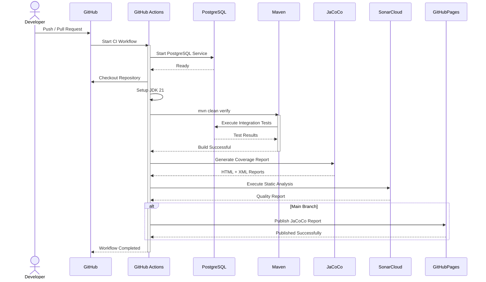

# Sequence Diagram — Continuous Integration Pipeline

> **AI-Commerce Platform**
>
> **Service:** Product Service  
> **Document:** Sequence Diagram - Continuous Integration Pipeline  
> **Version:** 1.0  
> **Status:** Active

---

# Purpose

This document describes the Continuous Integration (CI) pipeline executed by GitHub Actions for the Product Service.

The pipeline validates every code change by building the project, executing automated tests, generating code coverage reports, performing static code analysis and publishing artifacts.

The objective is to guarantee code quality before changes are merged into the main branches.

---

# Scope

The workflow is defined in:

```text
.github/workflows/ci.yml
```

The pipeline executes automatically for pushes and pull requests targeting the supported branches.

---

# Trigger

The workflow is triggered when:

- Push to `main`
- Push to `develop`
- Push to `feature/**`
- Pull Request to `main`
- Pull Request to `develop`

---

# Actors

| Actor | Responsibility |
|--------|----------------|
| Developer | Pushes source code |
| GitHub | Triggers the workflow |
| GitHub Actions Runner | Executes the pipeline |
| PostgreSQL | Supports integration tests |
| Maven | Builds and tests the application |
| JaCoCo | Generates code coverage reports |
| SonarCloud | Performs static code analysis |
| GitHub Pages | Publishes HTML coverage reports |

---

# Sequence Diagram



---

# Pipeline Stages

| Stage | Description |
|--------|-------------|
| Checkout | Retrieves the latest source code |
| JDK Setup | Configures Java 21 |
| PostgreSQL | Starts a temporary database instance |
| Build | Compiles the project |
| Unit Tests | Executes unit tests |
| Integration Tests | Executes integration tests using PostgreSQL |
| JaCoCo | Generates coverage reports |
| SonarCloud | Performs static code analysis |
| GitHub Pages | Publishes HTML coverage reports |

---

# Architectural Decisions

## Automated Validation

Every code change is validated automatically before merge.

---

## Production-like Testing

Integration tests execute against a real PostgreSQL instance.

---

## Continuous Code Quality

SonarCloud continuously verifies:

- Bugs
- Vulnerabilities
- Code Smells
- Coverage
- Maintainability

---

## Coverage Reporting

JaCoCo generates XML and HTML reports.

The HTML report is automatically published on the main branch.

---

# Operational Considerations

- Pipeline execution occurs on Ubuntu runners.
- Maven dependencies are cached.
- PostgreSQL is provisioned as a temporary service.
- Pipeline failures block successful validation.

---

# Future Evolution

Future CI stages may include:

```text
Build
      │
      ▼
Unit Tests
      │
      ▼
Integration Tests
      │
      ▼
JaCoCo
      │
      ▼
SonarCloud
      │
      ▼
OWASP Dependency Check
      │
      ▼
Trivy Scan
      │
      ▼
Docker Build
      │
      ▼
Container Image Scan
      │
      ▼
Deploy Kubernetes
```

---

# Related Documents

- Sequence Diagram — CodeQL Security Analysis
- Sequence Diagram — Flyway Database Migration
- Sequence Diagram — Application Startup