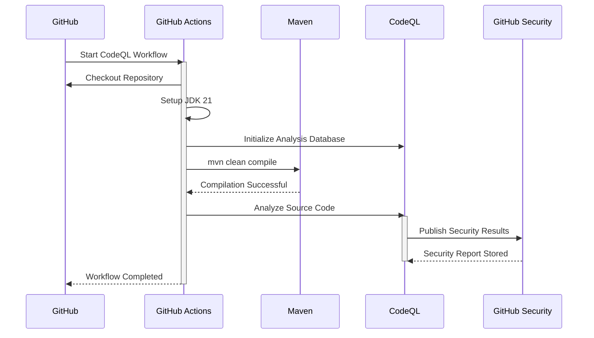

# Sequence Diagram — CodeQL Security Analysis

> **AI-Commerce Platform**
>
> **Service:** Product Service  
> **Document:** Sequence Diagram - CodeQL Security Analysis  
> **Version:** 1.0  
> **Status:** Active

---

# Purpose

This document describes the automated security analysis executed by GitHub CodeQL.

CodeQL performs static analysis on the Java source code to detect security vulnerabilities, unsafe coding patterns and potential defects before deployment.

---

# Scope

The workflow is defined in:

```text
.github/workflows/codeql.yml
```

The workflow executes automatically during software development and on a scheduled basis.

---

# Trigger

The workflow executes when:

- Push to `main`
- Push to `develop`
- Pull Request to `main`
- Pull Request to `develop`
- Weekly scheduled scan

---

# Actors

| Actor | Responsibility |
|--------|----------------|
| GitHub | Triggers the workflow |
| GitHub Actions Runner | Executes the analysis |
| Maven | Compiles the application |
| CodeQL | Performs security analysis |
| GitHub Security | Publishes security findings |

---

# Sequence Diagram



---

# Analysis Stages

| Stage | Description |
|--------|-------------|
| Checkout | Retrieves project source code |
| JDK Setup | Configures Java 21 |
| Initialize CodeQL | Creates the CodeQL analysis database |
| Build | Compiles the application |
| Analysis | Performs static security analysis |
| Publish Results | Stores findings in GitHub Security |

---

# Security Analysis Scope

CodeQL inspects the application for:

- SQL Injection
- Command Injection
- Path Traversal
- Unsafe Deserialization
- Resource Leaks
- Hardcoded Credentials
- Insecure API Usage
- Concurrency Issues
- Null Pointer Risks
- Java Security Best Practices

---

# Architectural Decisions

## Shift Left Security

Security analysis is integrated into the development lifecycle.

---

## Automated Security

Every supported branch is automatically scanned.

---

## Continuous Security Assessment

Scheduled execution ensures periodic security validation, even when no code changes occur.

---

## GitHub Native Security

Security findings are centralized in GitHub Security for review and remediation.

---

# Operational Considerations

- Analysis executes on Ubuntu runners.
- The project must compile successfully before analysis.
- Security findings are available directly within the GitHub repository.
- Weekly scheduled scans help identify newly detectable issues.

---

# Future Evolution

Future security stages may include:

```text
CodeQL
      │
      ▼
OWASP Dependency Check
      │
      ▼
Trivy Container Scan
      │
      ▼
Secret Scanning
      │
      ▼
SBOM Generation
      │
      ▼
Dependency Review
```

This layered security strategy will strengthen the DevSecOps practices adopted by the AI-Commerce Platform.

---

# Related Documents

- Sequence Diagram — Continuous Integration Pipeline
- Sequence Diagram — Application Startup
- Deployment Diagram
- Security Architecture