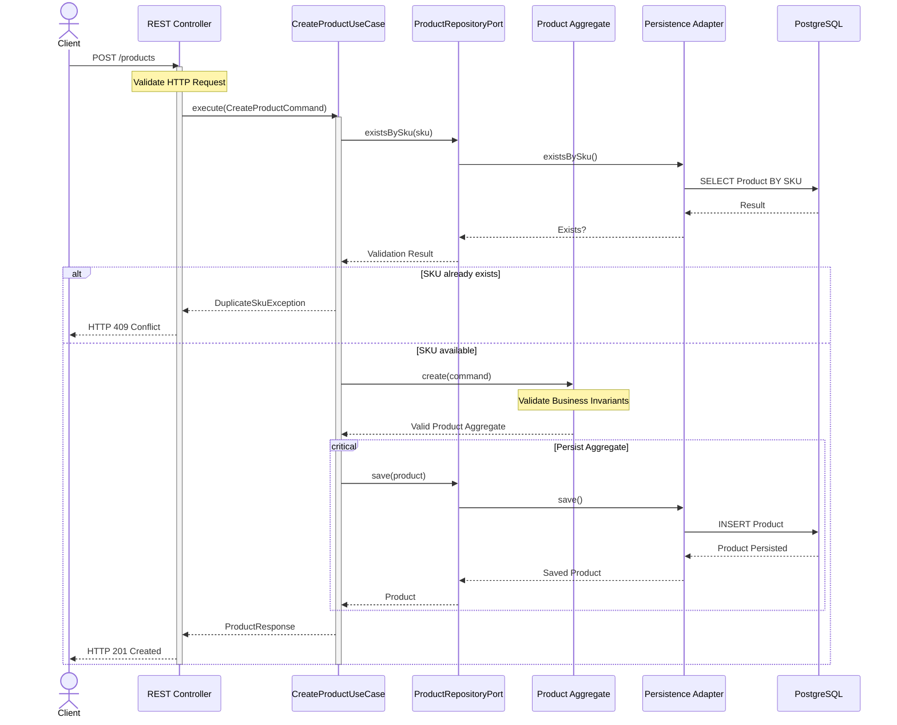

# Sequence Diagram — Create Product

> **AI-Commerce Platform**
>
> **Service:** Product Service  
> **Document:** Sequence Diagram - Create Product  
> **Version:** 1.0  
> **Status:** Active

---

# Purpose

This document describes the execution flow of the **Create Product** use case.

It illustrates how the Product Service processes a product creation request, validates business rules, creates the Product Aggregate and persists it while preserving the principles of Domain-Driven Design (DDD), Hexagonal Architecture and Clean Architecture.

This sequence focuses on architectural responsibilities rather than implementation details.

---

# Endpoint

| Method | Endpoint |
|---------|----------|
| POST | `/products` |

---

# Actors

| Actor | Responsibility |
|--------|----------------|
| Client | Sends the product creation request |
| REST Controller | Receives and validates the HTTP request |
| CreateProductUseCase | Coordinates the business workflow |
| Product Aggregate | Enforces business rules and creates the aggregate |
| ProductRepositoryPort | Repository abstraction used by the domain |
| Persistence Adapter | Implements persistence using Spring Data JPA |
| PostgreSQL | Stores product data |

---

# Preconditions

The following conditions must be satisfied before execution.

- The request payload is valid.
- All mandatory fields are provided.
- The SKU does not already exist.
- The database is available.

---

# Sequence Diagram



---

# Main Flow

| Step | Description |
|------|-------------|
| 1 | The client sends a **POST /products** request. |
| 2 | The REST Controller validates the HTTP request and converts it into a command. |
| 3 | The Create Product Use Case starts the business workflow. |
| 4 | The repository verifies whether the SKU already exists. |
| 5 | The Product Aggregate validates business rules and creates a consistent aggregate. |
| 6 | The aggregate is persisted through the Repository Port. |
| 7 | PostgreSQL stores the product. |
| 8 | The client receives **HTTP 201 Created** with the created resource. |

---

# Alternative Flows

## Duplicate SKU

If another product already uses the same SKU:

- The repository reports that the SKU exists.
- The use case throws **DuplicateSkuException**.
- The controller returns **HTTP 409 Conflict**.

---

## Invalid Request

If the request payload is invalid:

- Bean Validation rejects the request.
- The use case is not executed.
- The client receives **HTTP 400 Bad Request**.

---

## Infrastructure Failure

If the persistence layer is unavailable:

- The Persistence Adapter cannot save the aggregate.
- The request fails.
- The client receives **HTTP 500 Internal Server Error**.

---

# Business Rules Applied

The following business rules are enforced during execution.

- Every product must have a unique SKU.
- Product name is mandatory.
- Business invariants are validated before persistence.
- Aggregate consistency is guaranteed before saving.
- Infrastructure cannot bypass domain rules.

---

# Postconditions

After successful execution:

- A new Product Aggregate has been created.
- The aggregate has been persisted successfully.
- Business invariants have been preserved.
- The client receives **HTTP 201 Created**.

---

# Architecture Notes

### Domain-Driven Design

The Product Aggregate owns all business rules related to product creation.

---

### Hexagonal Architecture

Persistence is accessed exclusively through the ProductRepositoryPort.

The Domain Layer has no knowledge of JPA, PostgreSQL or Spring Framework.

---

### Dependency Inversion

The Application Layer depends only on abstractions defined by the domain.

---

### Transaction Boundary

The entire use case is executed within a single application transaction, ensuring aggregate consistency.

---

### Validation Strategy

Input validation occurs in two stages:

- **Request validation** performed by the REST Controller.
- **Business validation** performed by the Product Aggregate.

---

# Future Evolution

The current workflow has been designed to evolve without modifying the business domain.

Future versions may introduce asynchronous event publishing.

```text
Create Product
        │
        ▼
Persist Aggregate
        │
        ▼
Publish ProductCreated Event
        │
        ▼
Kafka
        │
        ├── Inventory Service
        ├── Search Service
        ├── Recommendation Service
        ├── Notification Service
        └── Audit Service
```

The event publication will be implemented through an **EventPublisherPort**, preserving the principles of Hexagonal Architecture.

---

# Related Documents

- C3 — Component Diagram
- Domain Model
- Hexagonal Architecture
- System Architecture
- ADR-001 — Hexagonal Architecture
- ADR-002 — Domain-Driven Design
- ADR-003 — Repository Pattern