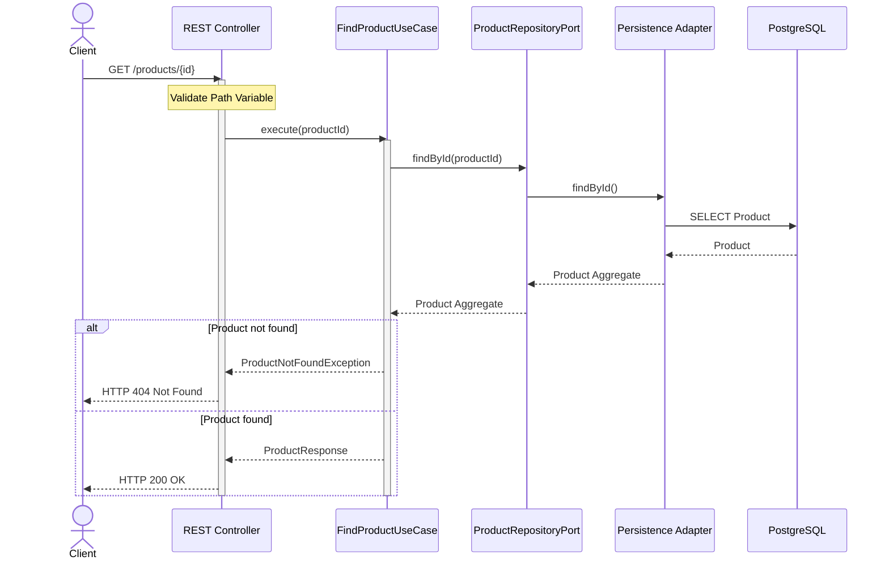

# Sequence Diagram — Find Product

> **AI-Commerce Platform**
>
> **Service:** Product Service  
> **Document:** Sequence Diagram - Find Product  
> **Version:** 1.0  
> **Status:** Active

---

# Purpose

This document describes the execution flow of the **Find Product** use case.

The Product Service retrieves a Product Aggregate by its identifier, validates its existence and returns a representation of the product to the client.

The workflow follows the principles of Domain-Driven Design (DDD), Hexagonal Architecture and Clean Architecture while keeping the Domain Layer independent from infrastructure technologies.

---

# Endpoint

| Method | Endpoint |
|---------|----------|
| GET | `/products/{id}` |

---

# Actors

| Actor | Responsibility |
|--------|----------------|
| Client | Requests product information |
| REST Controller | Receives and validates the HTTP request |
| FindProductUseCase | Coordinates the retrieval workflow |
| ProductRepositoryPort | Repository abstraction |
| Persistence Adapter | Implements persistence using Spring Data JPA |
| PostgreSQL | Stores product information |

---

# Preconditions

The following conditions must be be satisfied before execution.

- The product identifier is valid.
- The database is available.

---

# Sequence Diagram



---

# Main Flow

| Step | Description |
|------|-------------|
| 1 | The client sends a **GET /products/{id}** request. |
| 2 | The REST Controller validates the path parameter. |
| 3 | The Find Product Use Case starts the retrieval workflow. |
| 4 | The repository searches for the Product Aggregate. |
| 5 | PostgreSQL returns the persisted aggregate. |
| 6 | The Product Response is returned to the client. |
| 7 | The client receives **HTTP 200 OK**. |

---

# Alternative Flows

## Product Not Found

If the requested product does not exist:

- The repository returns no aggregate.
- The use case throws **ProductNotFoundException**.
- The controller returns **HTTP 404 Not Found**.

---

## Invalid Identifier

If the identifier is malformed:

- Request validation fails.
- The use case is not executed.
- The client receives **HTTP 400 Bad Request**.

---

## Infrastructure Failure

If the database cannot be reached:

- The repository cannot retrieve the aggregate.
- The client receives **HTTP 500 Internal Server Error**.

---

# Business Rules Applied

The following business rules are applied.

- The product must exist.
- Deleted products are handled according to the service policy.
- The Product Aggregate is never accessed directly by external clients.
- Infrastructure components cannot expose persistence entities.

---

# Postconditions

After successful execution:

- The Product Aggregate has been retrieved.
- A ProductResponse DTO has been returned.
- No business state has been modified.
- The client receives **HTTP 200 OK**.

---

# Architecture Notes

### Read-Only Operation

This use case does not modify the Product Aggregate.

---

### Hexagonal Architecture

The Application Layer retrieves data exclusively through the ProductRepositoryPort.

---

### Domain-Driven Design

The Domain Layer remains isolated from persistence technologies.

---

### Dependency Inversion

Infrastructure implements the repository contract defined by the domain.

---

### Response Mapping

The Product Aggregate is transformed into a ProductResponse DTO before leaving the application boundary.

Persistence entities are never exposed to external clients.

---

# Future Evolution

Future versions may optimize this workflow using a distributed cache.

```text
Find Product
        │
        ▼
Redis Cache
   │
   ├── Cache Hit
   │       │
   │       ▼
   │   Return Product
   │
   └── Cache Miss
           │
           ▼
    PostgreSQL
           │
           ▼
      Populate Cache
           │
           ▼
      Return Product
```

The cache layer will be implemented through a dedicated **CachePort**, preserving the principles of Hexagonal Architecture.

---

# Related Documents

- C3 — Component Diagram
- Domain Model
- Hexagonal Architecture
- System Architecture
- ADR-001 — Hexagonal Architecture
- ADR-005 — Repository Pattern