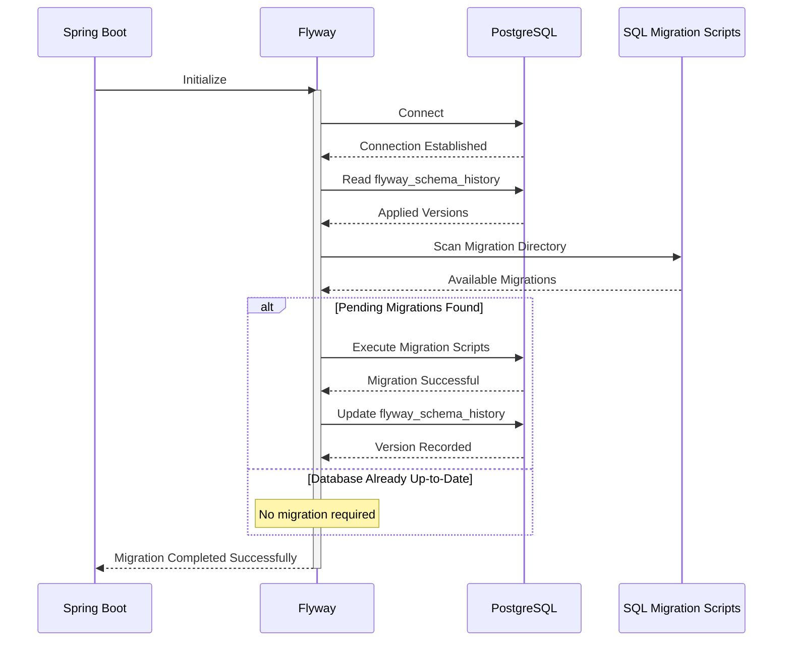

# Sequence Diagram — Flyway Database Migration

> **AI-Commerce Platform**
>
> **Service:** Product Service  
> **Document:** Sequence Diagram - Flyway Database Migration  
> **Version:** 1.0  
> **Status:** Active

---

# Purpose

This document describes the execution flow of the Flyway database migration process during the startup of the Product Service.

Flyway automatically validates the current database schema, executes pending migration scripts and ensures that the application starts with the expected database structure.

The migration process guarantees schema consistency across Development, Testing, Staging and Production environments.

---

# Scope

This sequence is executed automatically during the Spring Boot application startup.

Database migrations are completed before the Product Service becomes available to process HTTP requests.

---

# Actors

| Actor | Responsibility |
|--------|----------------|
| Spring Boot | Initializes the application context |
| Flyway | Validates and executes database migrations |
| PostgreSQL | Stores the application schema |
| SQL Migration Scripts | Define incremental schema changes |

---

# Preconditions

The following conditions must be satisfied before execution.

- PostgreSQL is running.
- Database credentials are valid.
- Flyway is enabled.
- Migration scripts are available in the configured location.
- The application can establish a database connection.

---

# Sequence Diagram



---

# Main Flow

| Step | Description |
|------|-------------|
| 1 | Spring Boot initializes the application. |
| 2 | Flyway establishes a connection with PostgreSQL. |
| 3 | Flyway validates the migration history. |
| 4 | Flyway scans the configured migration directory. |
| 5 | Pending migration scripts are identified. |
| 6 | SQL scripts are executed sequentially. |
| 7 | The migration history table is updated. |
| 8 | Spring Boot continues the application startup. |

---

# Alternative Flows

## Database Already Updated

If no pending migrations are found:

- Flyway validates the existing schema.
- No SQL scripts are executed.
- Application startup continues normally.

---

## Migration Failure

If a migration fails:

- Flyway immediately stops the migration process.
- The database remains in a consistent state according to the configured Flyway strategy.
- Spring Boot startup is interrupted.
- The Product Service is not started.

---

## Database Connection Failure

If PostgreSQL is unavailable:

- Flyway cannot establish a connection.
- No migration is executed.
- Application startup fails.

---

# Migration Strategy

The Product Service adopts **Flyway Versioned Migrations** to manage database schema evolution.

Each migration:

- Has a unique version number.
- Is immutable after execution.
- Is executed only once.
- Is recorded in the `flyway_schema_history` table.
- Is version controlled together with the application source code.

Current migration:

```text
V1__create_products_table.sql
```

The initial migration creates the Product persistence structure and the indexes required to support the current application queries.

---

# Current Database Model

The current database schema consists of a single aggregate persistence table.

```text
products
│
├── Primary Key (id)
├── Unique Constraint (sku)
├── Brand Reference
├── Category Reference
├── Product Status
├── Audit Columns
│     ├── created_at
│     └── updated_at
└── Performance Indexes
```

---

# Database Objects

## Table

```text
products
```

| Column | Type | Description |
|----------|------|-------------|
| id | UUID | Product identifier |
| sku | VARCHAR(50) | Unique Stock Keeping Unit |
| name | VARCHAR(150) | Product name |
| description | VARCHAR(1000) | Product description |
| brand_id | UUID | Brand identifier |
| category_id | UUID | Category identifier |
| status | VARCHAR(20) | Product lifecycle status |
| created_at | TIMESTAMP | Creation timestamp |
| updated_at | TIMESTAMP | Last modification timestamp |

---

## Indexes

The following indexes are created to optimize query performance.

| Index | Purpose |
|---------|---------|
| idx_products_sku | Fast product lookup by SKU |
| idx_products_brand | Brand-based queries |
| idx_products_category | Category filtering |
| idx_products_status | Product status filtering |

---

## Flyway Metadata

Flyway maintains the following metadata table.

```text
flyway_schema_history
```

This table records:

- Installed version
- Migration description
- Script name
- Installation timestamp
- Execution status
- Checksum

---

# Architectural Decisions

## Database Versioning

Every database modification must be represented by a new Flyway migration.

Previously executed migrations are never modified.

---

## Immutable Migrations

Migration scripts are immutable.

This guarantees reproducible deployments across all environments.

---

## Automated Execution

Database migrations are executed automatically during application startup.

No manual SQL execution is required.

---

## Fail Fast Principle

If any migration fails, the Product Service does not start.

This prevents the application from running against an inconsistent database schema.

---

## Aggregate Persistence

The `products` table represents the persistence model of the Product Aggregate.

Although the current implementation maps the aggregate to a single table, the persistence model may evolve independently from the Domain Model as new business requirements emerge.

The Domain Layer remains completely isolated from database implementation details.

---

# Operational Considerations

## Startup Time

Migration execution increases application startup time proportionally to the number of pending migrations.

---

## Rollback Strategy

Flyway does not automatically rollback failed migrations.

Rollback procedures must be defined according to the deployment strategy adopted by the platform.

---

## Monitoring

Migration execution should be monitored through:

- Application logs
- CI/CD pipelines
- Kubernetes events
- Cloud monitoring services

---

## CI/CD Integration

Flyway migrations are executed automatically before the Product Service becomes available during deployments.

This guarantees that every application version is executed against the expected database schema.

---

# Postconditions

After successful execution:

- The database schema is fully synchronized.
- Migration history has been updated.
- Spring Boot continues the initialization process.
- The Product Service becomes ready to accept HTTP requests.

---

# Future Evolution

Future schema changes will be introduced through new versioned migration scripts.

Possible future migrations include:

- Product attributes
- Product images
- Inventory integration
- Pricing history
- Audit improvements
- Additional indexes
- Performance optimizations

Every schema evolution will be managed through Flyway, preserving a complete and auditable history of database changes.

---

# Related Documents

- Sequence Diagram — Application Startup
- Sequence Diagram — Request Lifecycle
- Deployment Diagram
- Infrastructure Diagram
- Domain Model
- ADR-004 — Database Versioning Strategy
- ADR-007 — Flyway Migration Strategy