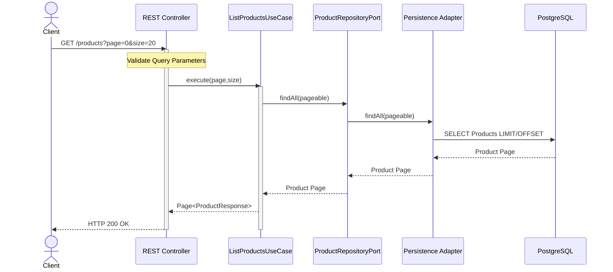

# Sequence Diagram — List Products

> **AI-Commerce Platform**
>
> **Service:** Product Service  
> **Document:** Sequence Diagram - List Products  
> **Version:** 1.0  
> **Status:** Active

---

# Purpose

This document describes the execution flow of the **List Products** use case.

The Product Service retrieves a paginated collection of products from the repository and returns a structured response to the client.

The workflow follows the architectural principles of Domain-Driven Design (DDD), Hexagonal Architecture and Clean Architecture while supporting scalability through pagination.

---

# Endpoint

| Method | Endpoint |
|---------|----------|
| GET | `/products` |

---

# Query Parameters

| Parameter | Description |
|------------|-------------|
| page | Requested page number |
| size | Number of items per page |
| sort | Sorting field *(future extension)* |
| direction | ASC or DESC *(future extension)* |
| filter | Business filters *(future extension)* |

---

# Actors

| Actor | Responsibility |
|--------|----------------|
| Client | Requests a paginated product list |
| REST Controller | Receives and validates query parameters |
| ListProductsUseCase | Coordinates the retrieval workflow |
| ProductRepositoryPort | Repository abstraction |
| Persistence Adapter | Implements persistence using Spring Data JPA |
| PostgreSQL | Stores product information |

---

# Preconditions

The following conditions must be satisfied before execution.

- Pagination parameters are valid.
- Database is available.

---

# Sequence Diagram



---

# Main Flow

| Step | Description |
|------|-------------|
| 1 | The client sends a paginated request. |
| 2 | The REST Controller validates pagination parameters. |
| 3 | The List Products Use Case starts the workflow. |
| 4 | The repository retrieves a page of products. |
| 5 | PostgreSQL executes the paginated query. |
| 6 | The application converts aggregates into ProductResponse DTOs. |
| 7 | The client receives **HTTP 200 OK** with a paginated response. |

---

# Alternative Flows

## Invalid Pagination Parameters

If page or size are invalid:

- Request validation fails.
- The use case is not executed.
- The client receives **HTTP 400 Bad Request**.

---

## Empty Result

If no products exist:

- An empty page is returned.
- The client still receives **HTTP 200 OK**.

---

## Infrastructure Failure

If PostgreSQL is unavailable:

- The repository cannot retrieve data.
- The client receives **HTTP 500 Internal Server Error**.

---

# Business Rules Applied

The following business rules are applied.

- Pagination is mandatory.
- Product ordering must be deterministic.
- Deleted products are handled according to business policy.
- Domain entities are never exposed directly.
- Responses are returned as DTOs.

---

# Response Example

```text
Page<ProductResponse>

├── content
├── page
├── size
├── totalElements
├── totalPages
├── first
├── last
└── numberOfElements
```

---

# Postconditions

After successful execution:

- A paginated collection of products has been retrieved.
- ProductResponse DTOs have been returned.
- No business state has been modified.
- The client receives **HTTP 200 OK**.

---

# Architecture Notes

### Read-Only Operation

This workflow does not modify the Product Aggregate.

---

### Hexagonal Architecture

The Application Layer accesses persistence exclusively through the ProductRepositoryPort.

---

### Pagination Strategy

Pagination is delegated to the persistence layer to minimize memory consumption and improve scalability.

---

### DTO Mapping

Only ProductResponse DTOs cross the application boundary.

Domain objects remain internal to the service.

---

### Performance Considerations

The use of pagination prevents loading the entire product catalog into memory.

This approach improves scalability and response time for large datasets.

---

# Future Evolution

Future versions may introduce additional query capabilities.

```text
Client
   │
   ▼
Pagination
   │
   ▼
Sorting
   │
   ▼
Filtering
   │
   ▼
Specification Pattern
   │
   ▼
Redis Cache
   │
   ▼
PostgreSQL
```

Potential future enhancements include:

- Dynamic filtering
- Full-text search
- Elasticsearch integration
- Redis cache
- Cursor-based pagination
- GraphQL support

---

# Related Documents

- C3 — Component Diagram
- Domain Model
- Hexagonal Architecture
- System Architecture
- ADR-001 — Hexagonal Architecture
- ADR-005 — Repository Pattern