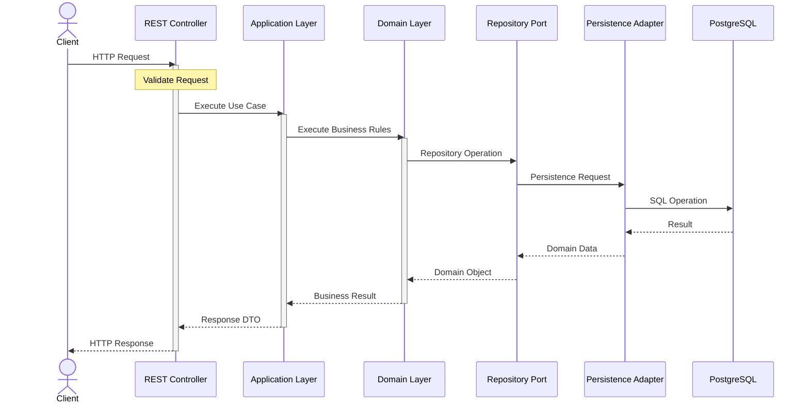

# Sequence Diagram — Request Lifecycle

> **AI-Commerce Platform**
>
> **Service:** Product Service  
> **Document:** Sequence Diagram - Request Lifecycle  
> **Version:** 1.0  
> **Status:** Active

---

# Purpose

This document describes the complete lifecycle of an HTTP request within the Product Service.

Unlike endpoint-specific sequence diagrams, this document provides a generic architectural view of how requests traverse the application layers, from the API boundary to the persistence layer and back to the client.

The sequence demonstrates the interaction between the architectural layers while preserving the principles of Domain-Driven Design (DDD), Hexagonal Architecture and Clean Architecture.

---

# Scope

This sequence applies to all REST endpoints exposed by the Product Service.

Examples include:

- POST /products
- GET /products/{id}
- GET /products
- PUT /products/{id}
- DELETE /products/{id}

---

# Actors

| Actor | Responsibility |
|--------|----------------|
| Client | Sends HTTP requests |
| REST Controller | Entry point of the application |
| Application Layer | Coordinates business workflows |
| Domain Layer | Executes business rules |
| Repository Port | Defines persistence contracts |
| Persistence Adapter | Implements repository contracts |
| PostgreSQL | Stores application data |

---

# Sequence Diagram



---

# Request Processing Flow

| Step | Description |
|------|-------------|
| 1 | The client sends an HTTP request. |
| 2 | The REST Controller validates the request. |
| 3 | The Application Layer executes the appropriate use case. |
| 4 | The Domain Layer applies business rules. |
| 5 | The Repository Port abstracts persistence operations. |
| 6 | The Persistence Adapter communicates with PostgreSQL. |
| 7 | The result is propagated back through the architectural layers. |
| 8 | The client receives the HTTP response. |

---

# Layer Responsibilities

## REST Controller

Responsible for:

- Receiving HTTP requests
- Request validation
- DTO mapping
- Returning HTTP responses

No business logic is implemented in this layer.

---

## Application Layer

Responsible for:

- Coordinating use cases
- Managing transactions
- Orchestrating business operations

Business rules remain outside this layer.

---

## Domain Layer

Responsible for:

- Product Aggregate
- Business rules
- Value Objects
- Domain Events
- Factories

The Domain Layer is completely independent of frameworks.

---

## Repository Port

Defines persistence contracts required by the Domain Layer.

The Domain Layer never depends on concrete persistence implementations.

---

## Persistence Adapter

Implements Repository Ports using Spring Data JPA.

Responsibilities include:

- Entity mapping
- SQL execution
- Database communication

---

## PostgreSQL

Responsible for persistent storage.

No business logic is implemented in the database.

---

# Architectural Principles Applied

The request lifecycle follows the architectural principles adopted by the Product Service.

### Separation of Concerns

Each architectural layer has a single responsibility.

---

### Dependency Inversion

The Domain Layer depends only on abstractions.

---

### Framework Independence

Business rules remain independent from Spring Boot and JPA.

---

### Encapsulation

Business invariants are protected inside the Product Aggregate.

---

### Testability

Each layer can be tested independently.

---

# Error Handling

Exceptions may be generated during any stage of the request lifecycle.

Examples include:

- Request validation failures
- Business validation failures
- Resource not found
- Persistence errors
- Infrastructure failures

All exceptions are centralized by the Global Exception Handler.

---

# Future Evolution

The current architecture supports additional infrastructure components without modifying the Domain Layer.

```text
HTTP Request
      │
      ▼
API Gateway
      │
      ▼
REST Controller
      │
      ▼
Application Layer
      │
      ▼
Domain Layer
      │
      ▼
Repository Port
      │
      ▼
Persistence Adapter
      │
      ├── PostgreSQL
      ├── Redis
      ├── Kafka
      ├── Elasticsearch
      └── AWS Services
```

Future adapters will continue implementing domain-defined ports, preserving the principles of Hexagonal Architecture.

---

# Related Documents

- C1 — System Context
- C2 — Container Diagram
- C3 — Component Diagram
- Domain Model
- Hexagonal Architecture
- System Architecture
- Deployment Diagram
- ADR-001 — Hexagonal Architecture
- ADR-002 — Domain-Driven Design